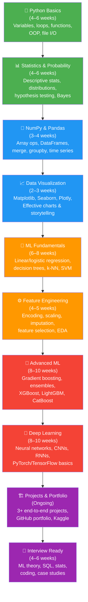

<div align="center">

# Learning Roadmaps

### Visual step-by-step paths from beginner to job-ready

</div>

---

> **How to read these roadmaps:**
> Each stage is listed with a time estimate. These are realistic estimates for someone studying **10–15 hours/week**. Full-time study cuts times roughly in half. Click on any node name to jump to the relevant content.

---

## Roadmap 1: Data Scientist Path

**Total estimated time: 12–18 months (part-time)**



### DS Roadmap — Detailed Stage Breakdown

| Stage | Topics | Resources | Time Estimate |
|-------|--------|-----------|---------------|
| [Python Basics](../04_Foundations/programming/python_for_ds.md) | Variables, control flow, OOP, file I/O, comprehensions | [Python for DS Guide](../04_Foundations/programming/python_for_ds.md) | 4–6 weeks |
| [Statistics](../04_Foundations/statistics/) | Descriptive stats, probability, distributions, hypothesis testing | [Statistics Notebooks](../04_Foundations/statistics/) | 4–6 weeks |
| [NumPy & Pandas](../01_Data_Scientist/beginner/) | Array operations, DataFrames, groupby, merges | [DS Beginner Notebooks](../01_Data_Scientist/beginner/) | 3–4 weeks |
| [Visualization](../01_Data_Scientist/beginner/) | Matplotlib, Seaborn, Plotly, chart design | [DS Beginner Notebooks](../01_Data_Scientist/beginner/) | 2–3 weeks |
| [ML Fundamentals](../01_Data_Scientist/intermediate/) | Supervised/unsupervised learning, model evaluation | [DS Intermediate](../01_Data_Scientist/intermediate/) | 6–8 weeks |
| [Feature Engineering](../01_Data_Scientist/intermediate/) | Encoding, imputation, selection, feature creation | [DS Intermediate](../01_Data_Scientist/intermediate/) | 4–5 weeks |
| [Advanced ML](../01_Data_Scientist/advanced/) | Gradient boosting, ensemble methods, hyperparameter tuning | [DS Advanced](../01_Data_Scientist/advanced/) | 8–10 weeks |
| [Deep Learning](../01_Data_Scientist/advanced/) | Neural nets, CNNs, RNNs, NLP basics | [DS Advanced](../01_Data_Scientist/advanced/) | 8–10 weeks |
| [Projects](../01_Data_Scientist/projects/) | End-to-end projects with real datasets | [DS Projects](../01_Data_Scientist/projects/) | Ongoing |
| [Interview Prep](../06_Interview_Prep/data_scientist/) | ML theory, SQL, case studies, coding | [DS Interview Prep](../06_Interview_Prep/data_scientist/) | 4–6 weeks |

---

## Roadmap 2: ML Engineer Path

**Total estimated time: 14–20 months (part-time)**

```mermaid
flowchart TD
    A["🐍 Python / Software Engineering\n(6–8 weeks)\nOOP, design patterns, testing,\nclean code, type hints"] --> B

    B["🐙 Git & Docker\n(2–3 weeks)\nVersion control, branching,\ncontainerization, Compose"] --> C

    C["🌐 REST APIs & FastAPI\n(3–4 weeks)\nHTTP, REST design, FastAPI,\nPydantic, async, testing"] --> D

    D["📦 ML Basics + Sklearn\n(4–6 weeks)\nML pipeline, transformers,\ncross-validation, metrics"] --> E

    E["🔬 MLflow & Experiment Tracking\n(3–4 weeks)\nExperiment logging, model registry,\nartifact management"] --> F

    F["🏗️ ML Pipelines\n(4–6 weeks)\nFeature stores, data validation,\nAirflow/Prefect, CI/CD for ML"] --> G

    G["☸️ Kubernetes & Cloud\n(6–8 weeks)\nK8s, Helm, GCP/AWS/Azure,\nmodel serving, autoscaling"] --> H

    H["⚡ Distributed Training\n(4–6 weeks)\nPyTorch Distributed, Ray Train,\nhorovod, gradient accumulation"] --> I

    I["🏭 ML Platform Engineering\n(6–8 weeks)\nEnd-to-end MLOps, monitoring,\ndrift detection, retraining"] --> J

    J["💼 Interview Ready\n(4–6 weeks)\nSystem design, ML design,\ncoding, production scenarios"]

    style A fill:#4CAF50,color:#fff
    style B fill:#4CAF50,color:#fff
    style C fill:#2196F3,color:#fff
    style D fill:#2196F3,color:#fff
    style E fill:#FF9800,color:#fff
    style F fill:#FF9800,color:#fff
    style G fill:#f44336,color:#fff
    style H fill:#f44336,color:#fff
    style I fill:#9C27B0,color:#fff
    style J fill:#9C27B0,color:#fff
```



### MLE Roadmap — Detailed Stage Breakdown

| Stage | Topics | Resources | Time Estimate |
|-------|--------|-----------|---------------|
| [Python / SWE](../04_Foundations/programming/python_for_ds.md) | OOP, design patterns, testing, type hints, packaging | [Python Guide](../04_Foundations/programming/python_for_ds.md) | 6–8 weeks |
| [Git & Docker](../02_ML_Engineer/beginner/) | Version control, Docker containers, Compose | [MLE Beginner](../02_ML_Engineer/beginner/) | 2–3 weeks |
| [REST APIs](../02_ML_Engineer/beginner/) | FastAPI, HTTP, Pydantic, async endpoints | [MLE Beginner](../02_ML_Engineer/beginner/) | 3–4 weeks |
| [ML with Sklearn](../02_ML_Engineer/beginner/) | Pipelines, transformers, model evaluation | [MLE Beginner](../02_ML_Engineer/beginner/) | 4–6 weeks |
| [MLflow](../02_ML_Engineer/intermediate/) | Experiment tracking, model registry, projects | [MLE Intermediate](../02_ML_Engineer/intermediate/) | 3–4 weeks |
| [ML Pipelines](../02_ML_Engineer/intermediate/) | Feature stores, data validation, orchestration | [MLE Intermediate](../02_ML_Engineer/intermediate/) | 4–6 weeks |
| [Kubernetes](../02_ML_Engineer/advanced/) | K8s, Helm, cloud deployment, autoscaling | [MLE Advanced](../02_ML_Engineer/advanced/) | 6–8 weeks |
| [Distributed Training](../02_ML_Engineer/advanced/) | PyTorch DDP, Ray, multi-GPU strategies | [MLE Advanced](../02_ML_Engineer/advanced/) | 4–6 weeks |
| [ML Platform](../02_ML_Engineer/advanced/) | End-to-end MLOps, monitoring, drift detection | [MLE Advanced](../02_ML_Engineer/advanced/) | 6–8 weeks |
| [Interview Prep](../06_Interview_Prep/ml_engineer/) | System design, ML design, coding | [MLE Interview Prep](../06_Interview_Prep/ml_engineer/) | 4–6 weeks |

---

## Roadmap 3: AI Engineer Path

**Total estimated time: 10–14 months (part-time)**

```mermaid
flowchart TD
    A["🔑 LLM APIs\n(2–3 weeks)\nOpenAI, Anthropic, Gemini APIs,\ntokens, context windows"] --> B

    B["✍️ Prompt Engineering\n(2–3 weeks)\nZero/few-shot, chain-of-thought,\nsystem prompts, templates"] --> C

    C["📚 RAG Basics\n(3–4 weeks)\nDocument loading, chunking,\nembeddings, vector search"] --> D

    D["🔗 LangChain & Orchestration\n(3–4 weeks)\nChains, memory, document loaders,\noutput parsers, LCEL"] --> E

    E["🗄️ Vector Databases\n(2–3 weeks)\nPinecone, Weaviate, Chroma,\nFAISS, similarity search"] --> F

    F["🤖 AI Agents\n(4–6 weeks)\nTool use, ReAct, planning,\nAutoGPT patterns, function calling"] --> G

    G["🚀 Production AI Systems\n(4–6 weeks)\nLatency optimization, cost control,\nmonitoring, safety, caching"] --> H

    H["🎯 LLM Fine-tuning\n(4–6 weeks)\nLoRA, QLoRA, PEFT,\nInstruction tuning, alignment"] --> I

    I["🌐 Advanced AI Systems\n(6–8 weeks)\nMulti-agent frameworks, GraphRAG,\nreasoning models, evals"] --> J

    J["💼 Interview Ready\n(3–4 weeks)\nLLM theory, system design,\nAI product design, coding"]

    style A fill:#4CAF50,color:#fff
    style B fill:#4CAF50,color:#fff
    style C fill:#2196F3,color:#fff
    style D fill:#2196F3,color:#fff
    style E fill:#FF9800,color:#fff
    style F fill:#FF9800,color:#fff
    style G fill:#f44336,color:#fff
    style H fill:#f44336,color:#fff
    style I fill:#9C27B0,color:#fff
    style J fill:#9C27B0,color:#fff
```



### AIE Roadmap — Detailed Stage Breakdown

| Stage | Topics | Resources | Time Estimate |
|-------|--------|-----------|---------------|
| [LLM APIs](../03_AI_Engineer/beginner/) | API calls, token management, rate limits, error handling | [AIE Beginner](../03_AI_Engineer/beginner/) | 2–3 weeks |
| [Prompt Engineering](../03_AI_Engineer/beginner/) | Zero/few-shot, CoT, system prompts, structured output | [AIE Beginner](../03_AI_Engineer/beginner/) | 2–3 weeks |
| [RAG Basics](../03_AI_Engineer/beginner/) | Document loading, chunking, embedding, retrieval | [AIE Beginner](../03_AI_Engineer/beginner/) | 3–4 weeks |
| [LangChain](../03_AI_Engineer/intermediate/) | Chains, LCEL, memory, output parsers | [AIE Intermediate](../03_AI_Engineer/intermediate/) | 3–4 weeks |
| [Vector Databases](../03_AI_Engineer/intermediate/) | Pinecone, Weaviate, Chroma, FAISS | [AIE Intermediate](../03_AI_Engineer/intermediate/) | 2–3 weeks |
| [AI Agents](../03_AI_Engineer/intermediate/) | Tool use, ReAct, function calling, planning | [AIE Intermediate](../03_AI_Engineer/intermediate/) | 4–6 weeks |
| [Production AI](../03_AI_Engineer/intermediate/) | Latency, cost, caching, monitoring, safety | [AIE Intermediate](../03_AI_Engineer/intermediate/) | 4–6 weeks |
| [Fine-tuning](../03_AI_Engineer/advanced/) | LoRA, QLoRA, PEFT, instruction tuning | [AIE Advanced](../03_AI_Engineer/advanced/) | 4–6 weeks |
| [Advanced Systems](../03_AI_Engineer/advanced/) | Multi-agent, GraphRAG, reasoning models, evals | [AIE Advanced](../03_AI_Engineer/advanced/) | 6–8 weeks |
| [Interview Prep](../06_Interview_Prep/ai_engineer/) | LLM theory, system design, AI product | [AIE Interview Prep](../06_Interview_Prep/ai_engineer/) | 3–4 weeks |

---

## Skill Prerequisites Matrix

This matrix shows which foundations are required or recommended for each track.

| Foundation Skill | Data Scientist | ML Engineer | AI Engineer | Notes |
|------------------|:--------------:|:-----------:|:-----------:|-------|
| **Python basics** | Required | Required | Required | Non-negotiable for all tracks |
| **Python OOP** | Recommended | Required | Recommended | Critical for MLE |
| **SQL** | Required | Recommended | Optional | DS uses SQL daily |
| **Statistics** | Required | Recommended | Helpful | Core to DS work |
| **Linear Algebra** | Recommended | Recommended | Helpful | Needed for DL theory |
| **Calculus** | Helpful | Helpful | Optional | Needed only for research |
| **Probability** | Required | Recommended | Helpful | Needed for model evaluation |
| **Git** | Recommended | Required | Required | Basic for collaboration |
| **Docker** | Optional | Required | Recommended | Critical for MLE |
| **Cloud basics** | Optional | Required | Recommended | Needed for production work |
| **Kubernetes** | Not needed | Required | Optional | MLE-specific |
| **LLM APIs** | Optional | Recommended | Required | Core to AIE |
| **Transformers** | Recommended | Recommended | Required | Foundation of modern NLP/AI |
| **ML fundamentals** | Required | Required | Helpful | Shared foundation |

### Legend
- **Required** — You will struggle without this. Learn it first.
- **Recommended** — Will make your work significantly easier. Learn it soon.
- **Helpful** — Useful to know, but can be learned as needed.
- **Optional** — Only needed for specific roles or advanced work.

---

## Cross-Track Connections

The three tracks share common foundations but diverge significantly at the intermediate level:

```
                    ┌─────────────────────────────────┐
                    │     SHARED FOUNDATIONS          │
                    │  Python · Git · ML Basics       │
                    │  Statistics · Linear Algebra    │
                    └───────────┬─────────────────────┘
                                │
              ┌─────────────────┼─────────────────────┐
              ▼                 ▼                       ▼
    ┌──────────────┐   ┌──────────────┐      ┌──────────────┐
    │ DATA         │   │ ML ENGINEER  │      │ AI ENGINEER  │
    │ SCIENTIST    │   │              │      │              │
    │              │   │ SWE skills   │      │ LLM APIs     │
    │ EDA + Stats  │   │ Docker/K8s   │      │ RAG/Agents   │
    │ ML modeling  │   │ MLOps        │      │ Fine-tuning  │
    │ Insights     │   │ Systems      │      │ Products     │
    └──────────────┘   └──────────────┘      └──────────────┘
          │                   │                     │
          └───────────────────┼─────────────────────┘
                              │
                    ┌─────────▼─────────┐
                    │  OVERLAP ZONES    │
                    │  DS+MLE: Feature  │
                    │  stores, serving  │
                    │  MLE+AIE: LLM     │
                    │  infra, fine-tune │
                    │  DS+AIE: NLP,     │
                    │  embeddings, evals│
                    └───────────────────┘
```

---

## Time Investment Summary

| Track | Casual (5h/week) | Dedicated (15h/week) | Full-time (40h/week) |
|-------|-----------------|---------------------|---------------------|
| Data Scientist | 24–36 months | 12–18 months | 4–6 months |
| ML Engineer | 28–40 months | 14–20 months | 5–7 months |
| AI Engineer | 20–28 months | 10–14 months | 3–5 months |

> **Note:** These estimates assume starting from basic Python. If you already have Python + ML basics, subtract 3–4 months from each path.

---

## Navigation

| Previous | Home | Next |
|----------|------|------|
| [Role Comparison](role_comparison.md) | [Main README](../README.md) | [How to Use This Repo](how_to_use.md) |