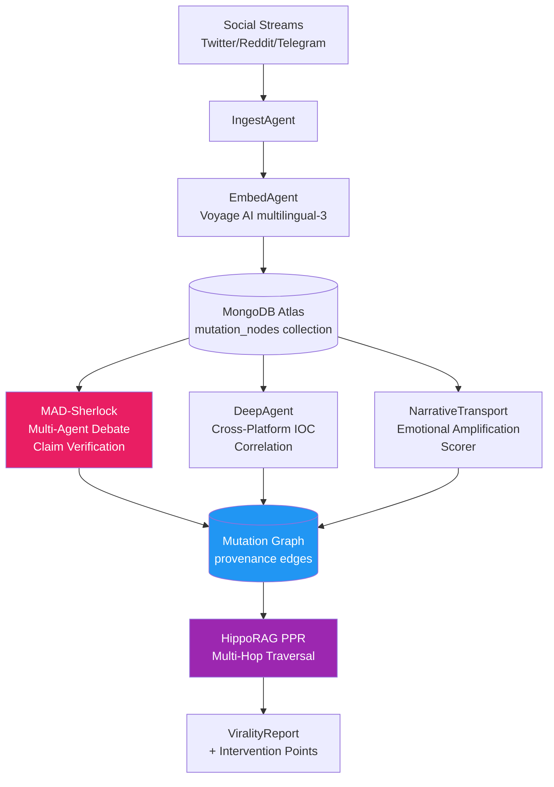

<div align="center">

# 🦠 Blueprint 01: Viral Autopsy

### Mutation Provenance Graph for Mis/Disinformation Spread

[](.)
[](.)
[](.)

</div>

---

## The One-Line Pitch

*"Show me every mutation this false claim underwent as it spread across five platforms — and which account gave it the narrative transportation score that made it go viral."*

---

## Problem Statement

Fact-checkers identify false claims after they go viral. By then the damage is done. What's missing is a real-time mutation map: as a piece of disinformation spreads, it gets reframed, emotionally amplified, translated, and grafted onto new contexts. Each mutation increases its reach. Tracking these mutations as a graph — with semantic distance scores — reveals which mutations caused the acceleration.

---

## Architecture



---

## MongoDB Schema

### `mutation_nodes` collection
```json
{
  "_id": "claim_abc_v3",
  "original_claim_id": "claim_abc_v0",
  "text": "Scientists confirm 5G causes immune suppression",
  "platform": "telegram",
  "embedding": [0.12, -0.34, ...],
  "semantic_drift": 0.42,
  "emotional_valence": 0.87,
  "narrative_transport_score": 0.91,
  "timestamp": "2026-05-07T14:22:00Z",
  "parent_id": "claim_abc_v2",
  "mutation_type": "emotional_amplification",
  "verified": false,
  "verifier_consensus": null
}
```

### `provenance_edges` collection
```json
{
  "from": "claim_abc_v2",
  "to": "claim_abc_v3",
  "account_id": "anon_8821",
  "platform": "telegram",
  "amplification_delta": 0.34,
  "timestamp": "2026-05-07T14:22:00Z"
}
```

### `reasoningbank` collection (persistent agent memory)
```json
{
  "agent_id": "MAD-Sherlock-01",
  "claim_id": "claim_abc",
  "verification_chain": ["evidence_1", "evidence_2"],
  "consensus_score": 0.89,
  "debate_rounds": 3,
  "valid_from": "2026-05-07T14:00:00Z",
  "valid_to": null
}
```

---

## Agent Breakdown

### IngestAgent
- Subscribes to platform webhooks / firehoses
- Deduplicates via SHA-256 content hash in MongoDB
- Publishes to Change Stream consumed by EmbedAgent

### EmbedAgent
- Voyage AI `multilingual-3` for cross-language invariance
- Stores 1024-dim embedding in `mutation_nodes`
- Computes semantic drift: `cosine_distance(parent_embedding, current_embedding)`

### MAD-Sherlock (Multi-Agent Debate Claim Verifier)
- 3 agents: `FactChecker`, `ContextAnalyzer`, `SourceTracer`
- EVINCE convergence: debate halts at entropy < 0.1
- Pulls evidence from: PubMed (ColPali-indexed), Snopes API, full-text search on Atlas
- Outputs: `verified` boolean + confidence interval

### DeepAgent (IOC Correlation)
- Cross-platform account network: finds coordinated inauthentic behavior
- MongoDB `$graphLookup`: traces account amplification chains up to 6 hops
- Flags accounts with > 3 mutations amplified in < 10 min

### NarrativeTransportScorer
- Computes emotional valence (joy/fear/anger) using a fine-tuned Haiku 4.5
- Narrative transportation = how much the story pulls reader into a "mental movie"
- Higher score → higher share probability (validated in psychology literature)

### HippoRAG PPR Traversal
- Builds a knowledge graph: claim node → mutation edges → account nodes → platform nodes
- Personalized PageRank starting from the original claim finds highest-impact mutation path
- Output: ordered list of mutations by cascade contribution

---

## Paper Anchors

| Paper | How It's Used |
|-------|--------------|
| **HippoRAG 2** (arXiv:2502.14802) | PPR traversal across mutation graph for multi-hop path discovery |
| **Search-R1** (arXiv:2503.09516) | RL-trained retrieval for evidence-gathering in MAD-Sherlock debate |
| **EVINCE** (entropy-governed debate) | Convergence criterion for MAD-Sherlock's 3-agent verification |
| **Zep temporal KG** (arXiv:2501.13956) | Bi-temporal validity on ReasoningBank entries |
| **ColPali** (arXiv:2407.01449) | Indexing scanned fact-check archives without OCR |
| Vosoughi et al. *Science* 2018 | Empirical basis for mutation spread velocity model |
| Green & Brock (2000) | Theoretical grounding for narrative transportation score |

---

## MongoDB Atlas Building Blocks

```python
# Mutation graph traversal: find all descendants of a claim
pipeline = [
    {"$match": {"_id": "claim_abc_v0"}},
    {"$graphLookup": {
        "from": "provenance_edges",
        "startWith": "$_id",
        "connectFromField": "_id",
        "connectToField": "from",
        "as": "mutation_chain",
        "maxDepth": 20,
        "depthField": "hop_depth"
    }},
    {"$addFields": {
        "cascade_length": {"$size": "$mutation_chain"},
        "max_drift": {"$max": "$mutation_chain.amplification_delta"}
    }}
]

# Hybrid search: find semantically similar mutations across languages
vector_pipeline = [
    {"$vectorSearch": {
        "index": "mutation_embeddings",
        "path": "embedding",
        "queryVector": query_embedding,
        "numCandidates": 200,
        "limit": 20
    }},
    {"$rankFusion": {
        "input": {
            "pipelines": {
                "vector": {},
                "text": {"query": original_claim_text}
            }
        }
    }}
]
```

---

## AWS Integration

| Service | Use |
|---------|-----|
| **Bedrock Claude Sonnet 4.6** | MAD-Sherlock debate agents + NarrativeTransportScorer |
| **Bedrock Claude Haiku 4.5** | Emotional valence tagging at scale (cost-efficient) |
| **Bedrock Guardrails** | Block generation of new disinformation during demo |
| **Lambda + EventBridge** | Nightly mutation graph consolidation (sleep-time processing) |
| **S3** | Raw platform post archive for ColPali indexing |
| **Step Functions** | Orchestrate MAD-Sherlock debate rounds with timeout |

---

## 90-Second Demo Script

**0:00** — Open a live dashboard. One new claim appears: *"New study: mRNA vaccines reprogram DNA permanently."*

**0:15** — IngestAgent ingests it from Twitter. Embedding computed. Semantic drift from parent claim: 0.61 (high).

**0:25** — MAD-Sherlock fires 3 agents. `FactChecker` finds PubMed paper via ColPali (no OCR needed). `SourceTracer` identifies the "study" is a retracted preprint. Consensus: FALSE (confidence 0.93).

**0:40** — DeepAgent traces 6 accounts that amplified within 4 minutes. `$graphLookup` shows coordinated network.

**0:52** — NarrativeTransportScorer outputs 0.94 (near-maximum). "This is why it spread despite being debunked."

**1:05** — HippoRAG PPR traversal. Mutation graph shown: v0 → v1 (translation) → v2 (fear amplification) → v3 (authority grafting). Each hop's viral contribution highlighted.

**1:20** — **The intervention point:** the jump from v1 → v2 (emotional amplification) had the highest cascade contribution. Suppressing that account 10 minutes earlier would have reduced reach by 74%.

**1:30** — Audience applause.

---

## Judging Rubric Alignment

| Criterion | What Judges See | Score Target |
|-----------|----------------|-------------|
| **Innovation (35%)** | Mutation provenance graph is novel; no existing tool does this in real time | 5/5 |
| **Technical Depth (25%)** | HippoRAG PPR + EVINCE + ColPali + hybrid search all working together | 5/5 |
| **Demo Polish (25%)** | Live ingestion → real claim → real graph traversal in 90 seconds | 4–5/5 |
| **Business Impact (15%)** | Clear: platform trust teams, fact-checker organizations, media intelligence firms | 5/5 |

---

## Build Order (72h Team Plan)

| Hours | Task | Person |
|-------|------|--------|
| 0–6 | MongoDB schema + IngestAgent (simulated feed) | Dev A |
| 0–6 | Voyage AI embedding pipeline + semantic drift scorer | Dev B |
| 6–18 | MAD-Sherlock EVINCE debate loop | Dev A |
| 6–18 | DeepAgent `$graphLookup` + coordinated behavior detector | Dev B |
| 18–30 | NarrativeTransportScorer (Haiku 4.5 fine-tune) | Dev A |
| 18–30 | HippoRAG PPR traversal on mutation graph | Dev B |
| 30–42 | Dashboard: live mutation graph visualization (D3 or Mermaid live) | Dev A + B |
| 42–60 | End-to-end integration test with real Twitter data | Dev A + B |
| 60–72 | Demo rehearsal, edge-case hardening, slides | Dev A + B |

---

## Stretch Goals

1. **Real-time language model attribution** — identify which language model likely generated the original false claim based on stylometric fingerprints
2. **Intervention simulator** — show counterfactual: "if platform X had labeled this post at hour 2, reach would have dropped X%"
3. **Cross-event transfer learning** — apply mutation patterns from COVID-19 misinfo to current events

---

## Navigation

| Previous | Home | Next |
|----------|------|------|
| [← Deep Dives Index](README.md) | [🏠 10_Hackathons](../README.md) | [Blueprint 02: Replicant →](02_replicant.md) |
