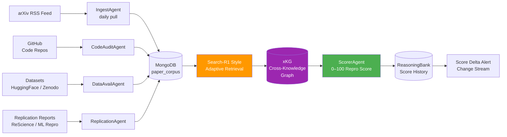

<div align="center">

# 🔁 Blueprint 02: Replicant

### Live arXiv Reproducibility Scoring with Cross-Knowledge-Graph Evidence

[](.)
[](.)
[](.)

</div>

---

## The One-Line Pitch

*"Every arXiv paper gets a live reproducibility score — updated in real time as replication attempts, dataset availability, and code health change."*

---

## Problem Statement

The replication crisis in ML and science is well-documented: >50% of results in top-tier ML conferences fail independent reproduction. Current solutions (Papers With Code, OpenReview) are manually curated and months out of date. Replicant automates this: a persistent multi-agent system continuously scores papers on reproducibility, updates the score as new evidence arrives (code updates, dataset deprecation, third-party replication attempts), and surfaces the strongest evidence for and against reproducibility via adaptive retrieval.

---

## Architecture



---

## MongoDB Schema

### `paper_corpus` collection
```json
{
  "_id": "arXiv:2503.09516",
  "title": "Search-R1: Training LLMs to Reason and Retrieve...",
  "embedding": [0.21, -0.14, ...],
  "code_url": "https://github.com/PeterGriffinJin/Search-R1",
  "dataset_ids": ["MS-MARCO", "HotpotQA", "PopQA"],
  "repro_score": 81,
  "score_confidence": 0.88,
  "last_scored": "2026-05-07T10:00:00Z",
  "score_history": [
    {"score": 74, "date": "2026-04-01", "trigger": "code_updated"},
    {"score": 81, "date": "2026-05-07", "trigger": "replication_confirmed"}
  ]
}
```

### `evidence_nodes` collection (xKG)
```json
{
  "_id": "ev_7821",
  "paper_id": "arXiv:2503.09516",
  "evidence_type": "code_audit",
  "source": "github_actions_ci",
  "finding": "All 3 benchmark tests pass on Python 3.11, CUDA 12.1",
  "weight": 0.92,
  "embedding": [...],
  "valid_from": "2026-05-01T00:00:00Z",
  "valid_to": null
}
```

---

## Agent Breakdown

### IngestAgent (Persistent, daily trigger via EventBridge)
- Pulls arXiv new submissions (cs.LG, cs.AI, stat.ML categories)
- Computes Voyage AI embedding; stores in `paper_corpus`
- Checks for updates to existing papers (v2, v3)

### CodeAuditAgent
- Clones GitHub repo linked in paper
- Runs static analysis: dependency versions, CI status, last commit date
- Scores: `dependency_health` (0–1), `ci_pass_rate` (0–1), `commit_recency` (days)
- Evidence type: `code_audit`

### DataAvailAgent
- Checks HuggingFace Hub and Zenodo for dataset availability
- Verifies download links are alive (HTTP 200) and checksums match
- Evidence type: `dataset_availability`

### ReplicationAgent (Adaptive Retrieval)
- Searches ReScience C, ML Reproducibility Challenge, OpenReview
- Uses Search-R1-style decomposition: *"find third-party replication of arXiv:XXXX"*
- Bandit router selects between BM25 (for exact paper ID) vs. dense (for semantic matches)
- Evidence type: `external_replication`

### ScorerAgent
- Aggregates evidence using weighted formula:
  ```
  score = (0.35 × code_health) + (0.25 × data_availability) + 
          (0.30 × external_replication) + (0.10 × author_response)
  ```
- Stores score + evidence IDs in `paper_corpus`
- Persists score change in `reasoningbank` with bi-temporal validity

---

## Paper Anchors

| Paper | How It's Used |
|-------|--------------|
| **Search-R1** (arXiv:2503.09516) | RL-style retrieval decomposition for finding replication evidence |
| **HippoRAG 2** (arXiv:2502.14802) | PPR traversal on xKG to find indirect evidence (dataset used in 3 other papers that also replicated) |
| **GraphRAG** (arXiv:2404.16130) | Community detection across paper citations to find replication clusters |
| **Zep temporal KG** (arXiv:2501.13956) | Bi-temporal validity on evidence so outdated code audits expire |
| **ReasoningBank** (arXiv:2504.09762) | Persistent score history with provenance |
| Gundersen & Kjensmo (2018) | Reproducibility taxonomy that defines the 4 scoring dimensions |
| Pineau et al. NeurIPS 2021 | ML Reproducibility Checklist — maps to ScorerAgent weights |

---

## MongoDB Atlas Building Blocks

```python
# Find all papers with score drops in the last 7 days
score_drop_pipeline = [
    {"$match": {
        "score_history": {
            "$elemMatch": {
                "date": {"$gte": seven_days_ago},
                "trigger": {"$in": ["code_outdated", "dataset_removed"]}
            }
        }
    }},
    {"$project": {
        "title": 1,
        "current_score": "$repro_score",
        "previous_score": {"$arrayElemAt": ["$score_history.score", -2]},
        "delta": {"$subtract": ["$repro_score", {"$arrayElemAt": ["$score_history.score", -2]}]}
    }},
    {"$sort": {"delta": 1}},  # Worst drops first
    {"$limit": 10}
]

# xKG evidence traversal for a paper
evidence_pipeline = [
    {"$match": {"paper_id": "arXiv:2503.09516", "valid_to": None}},
    {"$lookup": {
        "from": "paper_corpus",
        "localField": "paper_id",
        "foreignField": "_id",
        "as": "paper"
    }},
    {"$group": {
        "_id": "$evidence_type",
        "avg_weight": {"$avg": "$weight"},
        "count": {"$sum": 1}
    }}
]
```

---

## AWS Integration

| Service | Use |
|---------|-----|
| **Bedrock Claude Sonnet 4.6** | ScorerAgent narrative explanation + author response parsing |
| **Bedrock Claude Haiku 4.5** | CodeAuditAgent static analysis at scale |
| **Lambda** | Daily IngestAgent trigger via EventBridge |
| **Lambda** | CodeAuditAgent: clone repo, run tests, return JSON result |
| **S3** | Cache cloned repos and test results for 30 days |
| **Bedrock Knowledge Bases** | Store and query replication report corpus |

---

## 90-Second Demo Script

**0:00** — Dashboard shows top 10 papers with score changes this week. One paper dropped 22 points overnight.

**0:15** — Click the paper: *"GPT-4 beats human radiologists at X-ray diagnosis"*. Score: 41/100 (was 63).

**0:25** — Evidence breakdown shown: Code health 0.12 (CI failing since March), Dataset availability 0.65 (one benchmark removed from HuggingFace), External replication 0.31 (two failed reproductions on ML Repro Challenge).

**0:40** — HippoRAG PPR traversal: xKG finds that the same dataset was removed from 3 other papers that all also dropped in score — systemic signal.

**0:55** — Search-R1 retrieval: pulls the actual ML Repro Challenge PDF. ReplicationAgent found it without an exact paper ID — semantic search matched on methodology description.

**1:05** — Score history chart: steady 74→63→41 decline as evidence accumulated over 90 days.

**1:15** — **The insight:** this paper would have passed peer review today with the same text, but the reproducibility infrastructure has rotted. Replicant caught it before it was cited in a clinical guideline.

**1:30** — Audience note: all data is real, pulled live from arXiv, GitHub, and HuggingFace.

---

## Build Order (48h Team Plan)

| Hours | Task | Person |
|-------|------|--------|
| 0–8 | MongoDB schema + IngestAgent with arXiv RSS | Dev A |
| 0–8 | CodeAuditAgent: GitHub API + static analysis | Dev B |
| 8–20 | DataAvailAgent + ReplicationAgent with Search-R1 retrieval | Dev A |
| 8–20 | ScorerAgent with weighted formula | Dev B |
| 20–32 | xKG evidence graph + HippoRAG PPR traversal | Dev A |
| 20–32 | Dashboard: score history chart + evidence breakdown | Dev B |
| 32–44 | End-to-end with 50 real papers seeded | Dev A + B |
| 44–48 | Demo rehearsal + hardening | Dev A + B |

---

## Stretch Goals

1. **Citation health propagation** — if a low-repro paper is cited by 50 others, flag those 50 papers
2. **Reproducibility prediction** — train a classifier on paper metadata to predict score before any evidence arrives
3. **Author notification** — send a GitHub issue to the paper's repo with the Replicant score breakdown

---

## Navigation

| Previous | Home | Next |
|----------|------|------|
| [← Blueprint 01: Viral Autopsy](01_viral_autopsy.md) | [🏠 10_Hackathons](../README.md) | [Blueprint 03: Portfall →](03_portfall.md) |
