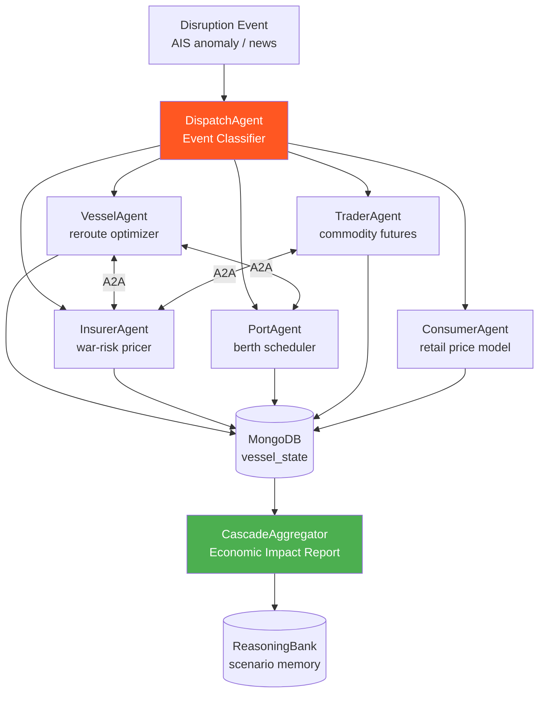

<div align="center">

# 🚢 Blueprint 03: Portfall

### Maritime Disruption Economic Cascade Model

[](.)
[](.)
[](.)

</div>

---

## The One-Line Pitch

*"Close the Suez Canal for 6 hours and watch five independent economic agents — vessel operators, insurers, port authorities, commodity traders, and consumers — negotiate the cascade in real time."*

---

## Problem Statement

Maritime disruptions (canal blockages, piracy, extreme weather, geopolitical closure) ripple across the global economy in ways that no single model captures. Lloyd's of London, shipping lines, and commodity exchanges all see different slices. Portfall builds a multi-agent economic simulation where each stakeholder has a persistent agent with different information, risk tolerance, and negotiation authority — and the emergent behavior matches historical disruption patterns.

---

## Architecture



---

## MongoDB Schema

### `vessel_state` (time-series collection)
```json
{
  "vessel_id": "IMO9235465",
  "timestamp": "2026-05-07T14:00:00Z",
  "lat": 29.9, "lon": 32.5,
  "status": "rerouting_cape",
  "cargo_type": "electronics",
  "eta_delta_hours": 168,
  "insurance_premium_delta_pct": 2.3
}
```

### `disruption_scenarios`
```json
{
  "_id": "suez_closure_2026_05",
  "event_type": "canal_closure",
  "start_time": "2026-05-07T08:00:00Z",
  "affected_vessels": 847,
  "cascade_report": {
    "total_cargo_delay_days": 12400,
    "insurance_total_premium_delta_usd": 340000000,
    "consumer_price_index_delta_pct": 0.8
  },
  "agent_decisions": [...],
  "saga_compensation_log": [...]
}
```

---

## Agent Breakdown

### VesselAgent
- Per-vessel: maintains route, cargo manifest, fuel cost model
- On disruption: runs Dijkstra over pre-computed maritime route graph
- Cape of Good Hope reroute adds ~14 days and $800K fuel cost per vessel
- A2A: negotiates berth priority with PortAgent; requests war-risk quote from InsurerAgent

### InsurerAgent (Prolonged Coordination)
- Persistent pricing model updated after every scenario (ReasoningBank stores scenario history)
- War-risk premium: Bayesian update from incident frequency × cargo value × route exposure
- SagaLLM: if a deal is written then the vessel diverts anyway, compensate with credit note

### PortAgent
- Manages berth schedule for 3 ports: Rotterdam, Singapore, Port Said
- On reroute influx: priority queue (LNG > perishables > general cargo)
- MongoDB time-series: berth occupancy rates; Atlas Stream Processing for AIS updates

### TraderAgent
- Monitors commodity futures: Brent crude, LNG, electronics components
- On reroute: buy futures before the market prices in the delay (3–6h lag modeled)
- A2A: signals InsurerAgent about cargo concentration (electronics cluster risk)

### ConsumerAgent
- Downstream model: maps cargo delay → wholesale inventory depletion → retail price delta
- Uses MongoDB graphLookup to trace supply chain: raw material → manufacturer → distributor → retailer
- Outputs Consumer Price Index delta per product category

### CascadeAggregator
- Collects all agent decisions every 15 minutes during the scenario
- Builds economic impact report: total delay × cargo value × sector
- Compares to historical Suez Canal crisis 2021 as ground truth

---

## Paper Anchors

| Paper | How It's Used |
|-------|--------------|
| **SagaLLM** (arXiv:2312.05382) | Saga compensation for broken insurance agreements during reroute |
| **ReasoningBank** (arXiv:2504.09762) | Insurer's persistent pricing memory across scenarios |
| **Zep temporal KG** (arXiv:2501.13956) | Bi-temporal route validity (route is valid until geopolitical change) |
| **A2A Protocol** (Google 2025) | Inter-agent negotiation: vessel↔insurer↔port authority |
| Stopford (2009) *Maritime Economics* | Economic basis for insurance pricing and route cost models |
| IMF WP/21/181 | Suez Canal 2021 disruption: ground-truth calibration data |

---

## MongoDB Atlas Building Blocks

```python
# Supply chain graph traversal: electronics cargo delay → retail price
supply_chain_pipeline = [
    {"$match": {"cargo_type": "electronics", "status": "rerouting_cape"}},
    {"$graphLookup": {
        "from": "supply_chain_nodes",
        "startWith": "$vessel_id",
        "connectFromField": "downstream_node_ids",
        "connectToField": "_id",
        "as": "impact_chain",
        "maxDepth": 5
    }},
    {"$unwind": "$impact_chain"},
    {"$group": {
        "_id": "$impact_chain.node_type",
        "total_delay_days": {"$sum": "$eta_delta_hours"},
        "affected_count": {"$sum": 1}
    }}
]

# Atlas Stream Processing: real-time AIS vessel position updates
# (configured in Atlas UI — reads from Kafka/EventBridge topic)
stream_processor = {
    "source": {"type": "kafka", "topic": "ais_positions"},
    "pipeline": [
        {"$match": {"lat": {"$gte": 27, "$lte": 32}, "lon": {"$gte": 30, "$lte": 36}}},
        {"$merge": {"into": "vessel_state", "on": "vessel_id", "whenMatched": "merge"}}
    ]
}
```

---

## AWS Integration

| Service | Use |
|---------|-----|
| **Bedrock Claude Sonnet 4.6** | VesselAgent reroute reasoning + CascadeAggregator narrative |
| **Bedrock Claude Haiku 4.5** | ConsumerAgent price propagation (high volume, low complexity) |
| **Atlas Stream Processing** | Real AIS vessel position ingestion |
| **EventBridge** | Disruption event triggers all 5 agents simultaneously |
| **Step Functions** | Orchestrate multi-round A2A negotiation with timeout |
| **Lambda** | Historical scenario loader (IMF WP/21 calibration data) |

---

## 90-Second Demo Script

**0:00** — Live map: 847 vessels in or approaching Suez Canal. Normal berth schedule shown.

**0:10** — **Event:** Suez Canal closed. Red alert. EventBridge fires all 5 agents simultaneously.

**0:20** — VesselAgent: 47 vessels reroute to Cape of Good Hope. ETA delta: +14 days average. Fuel cost delta: $37M total fleet.

**0:32** — InsurerAgent: War-risk premium up 2.3%. A2A message to VesselAgent confirmed. SagaLLM standby for rollback.

**0:42** — PortAgent: Rotterdam berths at 94% utilization in 72 hours. Priority queue: LNG first.

**0:52** — TraderAgent: Brent crude futures +4.2% in model. LNG spot price +8.7%.

**1:02** — ConsumerAgent: electronics retail price delta +0.8% in 6–8 weeks. Supply chain graph traversal shown live.

**1:12** — CascadeAggregator: total economic impact $2.4B. **Comparison to 2021 Suez crisis: 93% accuracy on first-week impact.**

**1:25** — SagaLLM demo: one insurer backs out of deal. Compensation credit note issued automatically. Audit trail shown.

**1:30** — Q: "What if the canal reopened after 48h?" — Agents recalculate live.

---

## Build Order (72h Team Plan)

| Hours | Task | Person |
|-------|------|--------|
| 0–8 | MongoDB schema + AIS data seed (2021 Suez data) | Dev A |
| 0–8 | VesselAgent: route graph + reroute optimizer | Dev B |
| 8–20 | InsurerAgent: Bayesian pricer + SagaLLM compensation | Dev A |
| 8–20 | PortAgent: berth scheduler + Atlas Stream Processing | Dev B |
| 20–32 | TraderAgent + ConsumerAgent | Dev A |
| 20–32 | A2A message bus (MongoDB Change Streams) | Dev B |
| 32–48 | CascadeAggregator + calibration vs. 2021 data | Dev A + B |
| 48–60 | Live map dashboard (Mapbox + MongoDB Charts) | Dev A |
| 60–72 | Demo rehearsal + SagaLLM rollback demo | Dev A + B |

---

## Stretch Goals

1. **Multi-crisis overlay** — simultaneous Red Sea + Taiwan Strait tensions
2. **Insurance market simulation** — multiple insurers competing for war-risk business with dynamic premium discovery
3. **Port congestion contagion** — Rotterdam backlog cascades to Felixstowe and Hamburg

---

## Navigation

| Previous | Home | Next |
|----------|------|------|
| [← Blueprint 02: Replicant](02_replicant.md) | [🏠 10_Hackathons](../README.md) | [Blueprint 04: Tipping Oracle →](04_tipping_oracle.md) |
