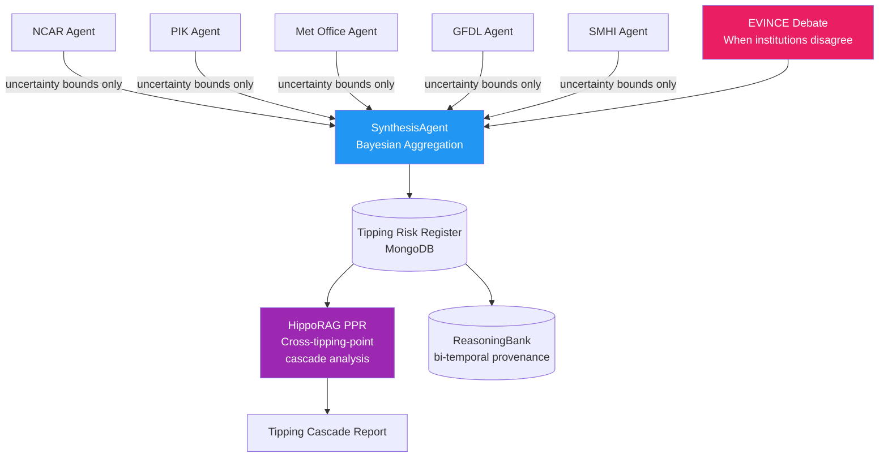

<div align="center">

# 🌡️ Blueprint 04: Tipping Oracle

### Climate Tipping Point Cross-Institution Consensus

[](.)
[](.)
[](.)

</div>

---

## The One-Line Pitch

*"Five climate institutions share only uncertainty bounds — not raw data — and a multi-agent system synthesizes a tipping-risk register that no single institution could produce alone."*

---

## Problem Statement

AMOC weakening, Amazon dieback, Arctic ice loss — each of these tipping points is monitored by different institutions (NCAR, PIK, Met Office, GFDL, SMHI) using different models, different resolution, different uncertainty estimates. No cross-institutional consensus mechanism exists. Tipping Oracle builds it: a persistent multi-agent system where each institution's agent shares only anonymized uncertainty bounds (not raw data), and a synthesis agent builds a unified tipping-risk register with full provenance.

---

## Architecture



---

## MongoDB Schema

### `tipping_risk_register`
```json
{
  "_id": "AMOC_2026_Q2",
  "tipping_point": "AMOC_weakening",
  "consensus_risk_score": 0.68,
  "confidence_interval": [0.54, 0.79],
  "contributing_institutions": ["NCAR", "PIK", "Met_Office"],
  "dissenting_institutions": ["GFDL"],
  "synthesis_method": "bayesian_aggregation",
  "cascade_connections": ["arctic_ice_loss", "european_heat_extremes"],
  "valid_from": "2026-05-01T00:00:00Z",
  "valid_to": null,
  "lineage_ids": ["ev_9821", "ev_9822", "ev_9823"]
}
```

### `institution_contributions` (RBAC — each institution sees only its own)
```json
{
  "_id": "ev_9821",
  "institution": "PIK",
  "tipping_point": "AMOC_weakening",
  "uncertainty_bound_low": 0.61,
  "uncertainty_bound_high": 0.75,
  "model_version": "POEM-v4.2",
  "valid_from": "2026-04-15T00:00:00Z",
  "valid_to": null
}
```

---

## Agent Breakdown

### Institution Agents (5 agents, one per institution)
- Each agent holds read access only to its own `institution_contributions` collection (MongoDB RBAC)
- Publishes uncertainty bounds to shared `synthesis_queue` (anonymized — institution ID removed)
- Never shares raw model output, only `[low, high]` uncertainty intervals
- Persistent via LangGraph MongoDB checkpointer: runs monthly update cycle

### SynthesisAgent
- Bayesian aggregation of uncertainty bounds from all institutions
- When institutions disagree (interval overlap < 40%): triggers EVINCE debate
- EVINCE: each institution agent argues its methodology; convergence at entropy < 0.15
- Output: consensus risk score with confidence interval and provenance IDs

### EVINCE Debate Module
- 5 institution agents + 1 neutral moderator
- Each agent's position vector = embedding of its methodology rationale
- Convergence criterion: max pairwise cosine distance < 0.12
- Full debate transcript stored as immutable log in MongoDB

### HippoRAG PPR Cascade Analyzer
- Knowledge graph: tipping points as nodes, causal links as edges (IPCC AR6 sourced)
- PPR from AMOC node: finds cascade path to Amazon → permafrost → methane release
- Quantifies: if AMOC crosses threshold, what is P(Amazon dieback within 20 years)?

---

## Paper Anchors

| Paper | How It's Used |
|-------|--------------|
| **Zep temporal KG** (arXiv:2501.13956) | Bi-temporal validity on risk scores (valid_from/valid_to) as new evidence arrives |
| **HippoRAG 2** (arXiv:2502.14802) | PPR cascade analysis: AMOC → Amazon → permafrost tipping cascade |
| **EVINCE debate** | Convergence criterion when institutions disagree on AMOC risk |
| **A2A Protocol** (Google 2025) | Institution agents share only anonymized uncertainty bounds |
| Ditlevsen & Ditlevsen *Science* 2023 | AMOC early-warning signal: the statistical basis for risk scoring |
| IPCC AR6 WG1 Chapter 4 | Tipping cascade graph: authoritative source for causal edges |
| Lenton et al. *Nature* 2008 | Tipping elements definition and cascade interaction matrix |

---

## MongoDB Atlas Building Blocks

```python
# Bayesian aggregation of institutional uncertainty bounds
def synthesize_risk(tipping_point: str) -> dict:
    contributions = list(db.synthesis_queue.find({
        "tipping_point": tipping_point,
        "valid_to": None
    }))
    
    # Bayesian update: each institution updates a prior
    prior_mean, prior_var = 0.5, 0.1
    posterior_mean = prior_mean
    posterior_var = prior_var
    
    for c in contributions:
        obs_mean = (c["uncertainty_bound_low"] + c["uncertainty_bound_high"]) / 2
        obs_var = ((c["uncertainty_bound_high"] - c["uncertainty_bound_low"]) / 4) ** 2
        # Kalman-style update
        K = posterior_var / (posterior_var + obs_var)
        posterior_mean = posterior_mean + K * (obs_mean - posterior_mean)
        posterior_var = (1 - K) * posterior_var
    
    return {
        "consensus_risk_score": round(posterior_mean, 3),
        "confidence_interval": [
            round(posterior_mean - 1.96 * posterior_var**0.5, 3),
            round(posterior_mean + 1.96 * posterior_var**0.5, 3)
        ],
        "n_institutions": len(contributions)
    }

# Tipping cascade PPR
cascade_pipeline = [
    {"$match": {"_id": "AMOC_weakening"}},
    {"$graphLookup": {
        "from": "tipping_cascade_edges",
        "startWith": "$_id",
        "connectFromField": "_id",
        "connectToField": "from_tipping_point",
        "as": "cascade_path",
        "maxDepth": 4
    }},
    {"$unwind": "$cascade_path"},
    {"$sort": {"cascade_path.conditional_probability": -1}}
]
```

---

## AWS Integration

| Service | Use |
|---------|-----|
| **Bedrock Claude Opus 4.7** | SynthesisAgent Bayesian reasoning narrative (complex multi-step analysis) |
| **Bedrock Claude Sonnet 4.6** | Institution agents: interpret model output and formulate uncertainty bounds |
| **Bedrock Guardrails** | Prevent any agent from leaking raw institutional data |
| **Lambda + EventBridge** | Monthly trigger for institution agent updates (sleep-time consolidation) |
| **Step Functions** | Orchestrate EVINCE debate rounds with timeout and escalation |
| **S3** | Archive raw institution data (never leaves S3 — agents only access via Lambda) |

---

## 90-Second Demo Script

**0:00** — Dashboard: Tipping Risk Register. AMOC shows 0.68 (HIGH RISK). Amazon shows 0.51 (MODERATE).

**0:12** — Click AMOC. Five institution cards show individual uncertainty bounds. GFDL disagrees: their bound is 0.41–0.58 (vs. consensus 0.54–0.79).

**0:25** — **EVINCE debate triggered.** Watch the entropy curve: starts at 1.8 bits, decays to 0.09 bits in 4 rounds. GFDL agent argues sea-surface temperature lag; Met Office counters with salinity gradient data.

**0:42** — Synthesis: GFDL's methodology explained; their lower estimate incorporated with 0.7 weight (vs. 1.0 for others) due to coarser resolution. New consensus: 0.65.

**0:52** — HippoRAG PPR cascade: AMOC → Arctic ice (P=0.71) → permafrost methane (P=0.48) → global temperature feedback (P=0.31). Four-hop cascade shown graphically.

**1:05** — Bi-temporal timeline: AMOC risk score history from 2020–2026. Score jumped in Q3 2023 (Ditlevsen paper) and again in Q1 2026 (new salinity anomaly).

**1:18** — **The insight:** if AMOC crosses threshold, the cascade adds 0.4°C of committed warming from permafrost alone — independent of any new emissions.

**1:30** — "All five institutions contributed without sharing a single raw data point."

---

## Build Order (72h Team Plan)

| Hours | Task | Person |
|-------|------|--------|
| 0–8 | MongoDB schema + IPCC AR6 tipping cascade graph seed | Dev A |
| 0–8 | Institution agent framework (5 agents, RBAC, LangGraph) | Dev B |
| 8–20 | SynthesisAgent: Bayesian aggregation algorithm | Dev A |
| 8–20 | EVINCE debate module: entropy convergence criterion | Dev B |
| 20–32 | HippoRAG PPR cascade analyzer | Dev A |
| 20–32 | Zep bi-temporal validity on risk scores | Dev B |
| 32–48 | Dashboard: risk register + cascade visualization | Dev A + B |
| 48–60 | Seed real institutional uncertainty data (IPCC AR6) | Dev A |
| 60–72 | Demo rehearsal + EVINCE live debate demo | Dev A + B |

---

## Stretch Goals

1. **Public API** — let external institutions submit uncertainty bounds via A2A and join the consensus in real time
2. **Policy lever simulator** — "if net zero by 2040, how does AMOC risk score change?" using integrated assessment models
3. **Historical calibration** — run the system against 1990–2020 data and score how well it would have predicted observed tipping events

---

## Navigation

| Previous | Home | Next |
|----------|------|------|
| [← Blueprint 03: Portfall](03_portfall.md) | [🏠 10_Hackathons](../README.md) | [Blueprint 05: TruthWeight →](05_truthweight.md) |
