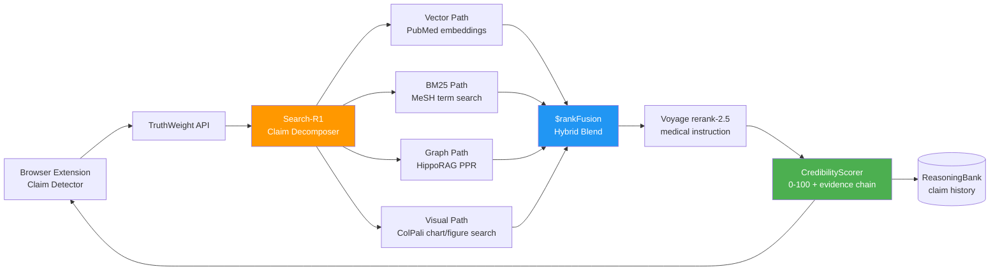

<div align="center">

# ⚖️ Blueprint 05: TruthWeight

### Real-Time Health Claim Credibility from Social Media + Peer Review

[](.)
[](.)
[](.)

</div>

---

## The One-Line Pitch

*"A browser sidebar that scores any health claim you see online — in real time — against PubMed, JMIR, and WHO guidelines, with HippoRAG multi-hop evidence chains."*

---

## Problem Statement

Health misinformation kills people. Vaccine hesitancy, unproven cancer treatments, supplement fraud — all spread on social media faster than fact-checkers can respond. TruthWeight provides a real-time credibility score for any health claim: a browser extension sidebar that fires an adaptive retrieval pipeline the moment a claim is detected, returning a 0–100 credibility score with the actual peer-reviewed evidence (or its absence) within 3 seconds.

---

## Architecture



---

## MongoDB Schema

### `pubmed_corpus` (pre-indexed)
```json
{
  "_id": "PMID:38291047",
  "title": "mRNA vaccine safety in pregnancy: systematic review",
  "abstract_embedding": [...],
  "full_text_embedding": [...],
  "mesh_terms": ["COVID-19 Vaccines", "Pregnancy", "Safety"],
  "evidence_level": "systematic_review",
  "journal_impact_factor": 28.3,
  "retraction_status": false,
  "colpali_figure_embeddings": [[...], [...]]
}
```

### `claim_verdicts`
```json
{
  "_id": "claim_hash_abc123",
  "claim_text": "mRNA vaccines cause infertility",
  "credibility_score": 4,
  "verdict": "FALSE",
  "evidence_for": [],
  "evidence_against": ["PMID:38291047", "PMID:37854119"],
  "evidence_chain": "claim → reproductive outcomes → RCT evidence → 0 mechanism found",
  "retrieval_time_ms": 1840,
  "valid_from": "2026-05-07T14:00:00Z"
}
```

---

## Agent Breakdown

### Browser Extension + Claim Detector
- Chrome/Firefox extension using MutationObserver on DOM
- NLP claim detection: health claim trigger words (vaccine, cure, causes, prevents)
- Sends detected claim to TruthWeight API via WebSocket

### Search-R1 Claim Decomposer
- Decomposes claim into sub-questions: "what is the mechanism?", "what evidence exists?", "are there RCTs?"
- Routes each sub-question to the optimal retrieval path
- Bandit router learns which path works best per claim type over time

### Retrieval Paths
- **Vector**: Voyage AI `voyage-medical-2` embeddings on 40M PubMed abstracts
- **BM25**: Atlas Search with MeSH term boosting (exact medical terminology)
- **Graph**: HippoRAG PPR — multi-hop: claim concept → related mechanisms → evidence studies
- **Visual**: ColPali on medical figures — graphs, forest plots, CONSORT diagrams

### Voyage rerank-2.5 with Medical Instructions
```python
reranker_instruction = """
You are a medical evidence ranker. Rank documents by their quality as 
evidence relevant to the claim. Prioritize: systematic reviews > RCTs > 
observational studies > case reports. Penalize: preprints, retracted papers,
animal-only studies when human evidence exists.
"""
```

### CredibilityScorer
- Weighted score: evidence quality × study count × consensus level
- Red flags: no human studies found, all evidence from same lab, retracted papers referenced
- Outputs score + natural language explanation for the sidebar

---

## Paper Anchors

| Paper | How It's Used |
|-------|--------------|
| **Search-R1** (arXiv:2503.09516) | RL-style decomposition of health claims into sub-questions |
| **HippoRAG 2** (arXiv:2502.14802) | Multi-hop PPR: mechanism → study → evidence quality chain |
| **ColPali** (arXiv:2407.01449) | Index medical figures — forest plots, CONSORT diagrams |
| **BRIGHT** (arXiv:2407.12883) | Reasoning-intensive retrieval benchmark for health claims |
| **Voyage rerank-2.5** | Medical-domain reranking with custom instruction |
| Swire-Thompson & Lazer (2020) | Health misinformation exposure → behavior change: motivation |
| Shekelle et al. (2003) | Evidence hierarchy (systematic review → RCT → observational) used in scoring |

---

## MongoDB Atlas Building Blocks

```python
# Hybrid search with medical MeSH boosting
def search_pubmed(claim_embedding: list, claim_text: str) -> list:
    pipeline = [
        {
            "$vectorSearch": {
                "index": "pubmed_vector_index",
                "path": "abstract_embedding",
                "queryVector": claim_embedding,
                "numCandidates": 200,
                "limit": 30,
                "filter": {"retraction_status": False}
            }
        },
        {
            "$rankFusion": {
                "input": {
                    "pipelines": {
                        "vector": {},
                        "text": {
                            "query": claim_text,
                            "path": ["title", "mesh_terms"]
                        }
                    }
                }
            }
        },
        {"$limit": 15}
    ]
    return list(db.pubmed_corpus.aggregate(pipeline))

# Evidence quality scoring
def score_evidence(docs: list) -> float:
    LEVEL_WEIGHTS = {
        "systematic_review": 1.0,
        "rct": 0.85,
        "cohort": 0.6,
        "case_control": 0.5,
        "case_report": 0.2,
        "preprint": 0.1
    }
    weights = [LEVEL_WEIGHTS.get(d.get("evidence_level", "case_report"), 0.1) 
               for d in docs]
    return sum(weights) / len(weights) if weights else 0.0
```

---

## AWS Integration

| Service | Use |
|---------|-----|
| **Bedrock Claude Sonnet 4.6** | CredibilityScorer: generate natural language explanation |
| **Bedrock Claude Haiku 4.5** | Claim detection and MeSH term extraction (high volume) |
| **Bedrock Guardrails** | Never output medical advice; disclaimer enforcement |
| **Lambda** | API backend for browser extension WebSocket connection |
| **Bedrock Knowledge Bases** | WHO guidelines corpus with managed RAG |
| **S3** | PubMed full-text PDFs for ColPali indexing |

---

## 90-Second Demo Script

**0:00** — Browser opens a TikTok video. Caption: *"Seed oils cause cancer — here's the science"*. Sidebar activates.

**0:08** — TruthWeight detects claim. Search-R1 decomposes: (a) "do seed oils cause cancer?" (b) "what is the proposed mechanism?" (c) "are there RCTs?"

**0:20** — Results arrive in 1.84 seconds. Score: **28/100 (LOW CREDIBILITY)**.

**0:30** — Evidence panel: 3 systematic reviews found. None support causation. One 2024 Cochrane review specifically refutes the mechanism.

**0:40** — HippoRAG PPR chain shown: "seed oils" → "linoleic acid" → "oxidative stress theory" → "6 studies tested this" → "null result in all 6." Four hops, 1.2 seconds.

**0:52** — ColPali found a figure from the video itself — a cherry-picked graph. TruthWeight found the original paper and shows the full graph (which shows no effect).

**1:05** — Red flag: the "study" linked in the video is a preprint, never peer-reviewed. Score would be 12/100 if preprint penalty applied.

**1:15** — User clicks "why 28 not lower?" — explanation: "Two observational studies do show correlation in high-consumption populations, but do not control for confounders." Transparency.

**1:30** — "Every score links to the actual papers. No black box."

---

## Build Order (48h Team Plan)

| Hours | Task | Person |
|-------|------|--------|
| 0–8 | PubMed indexing pipeline (40K papers subset) | Dev A |
| 0–8 | Browser extension: claim detection + WebSocket API | Dev B |
| 8–20 | Search-R1 decomposer + bandit router | Dev A |
| 8–20 | Hybrid search pipeline + Voyage rerank-2.5 | Dev B |
| 20–32 | HippoRAG PPR on PubMed knowledge graph | Dev A |
| 20–32 | CredibilityScorer + evidence quality model | Dev B |
| 32–44 | End-to-end integration + sidebar UI | Dev A + B |
| 44–48 | Demo rehearsal with real TikTok/YouTube claims | Dev A + B |

---

## Stretch Goals

1. **Claim memory** — if the same claim is checked 1,000 times, the score is cached and precomputed; only novel claims hit the full pipeline
2. **Score drift alerts** — if a claim's score changes significantly (new Cochrane review), notify users who previously checked it
3. **Multilingual** — Voyage `multilingual-3` enables the same pipeline for Spanish, French, Arabic health claims

---

## Navigation

| Previous | Home | Next |
|----------|------|------|
| [← Blueprint 04: Tipping Oracle](04_tipping_oracle.md) | [🏠 10_Hackathons](../README.md) | [Blueprint 06: ChronoLaw →](06_chronolaw.md) |
