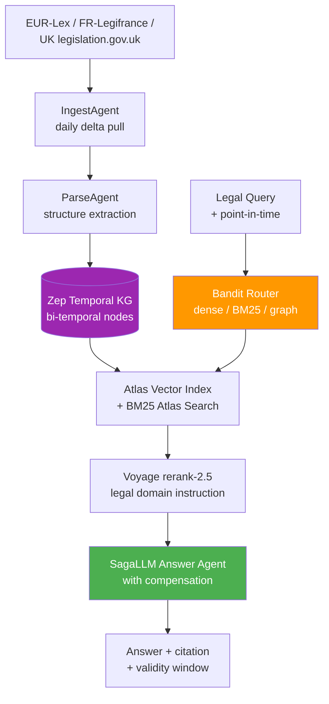

<div align="center">

# ⏱️ Blueprint 06: ChronoLaw

### Bi-Temporal Law-as-Living-Graph

[](.)
[](.)
[](.)

</div>

---

## The One-Line Pitch

*"Ask 'what was the law on data privacy in Germany on March 14, 2018 at 9am?' and get the exact regulatory text as it existed in that moment — not the current version."*

---

## Problem Statement

Law changes continuously. GDPR replaced the Data Protection Directive. CCPA was amended in 2020. Tax laws change annually. Current legal search tools (Westlaw, LexisNexis) show you the current state of law and sometimes a "historical" version — but they cannot answer: "what exactly was the law at the moment a decision was made?" This is critical for compliance audits, retroactive litigation, and regulatory research. ChronoLaw builds a bi-temporal knowledge graph of law that separates *when the law was valid* (valid time) from *when we learned about it* (transaction time).

---

## Architecture



---

## MongoDB Schema: Bi-Temporal Law Nodes

```json
{
  "_id": "GDPR_Art_17_v3",
  "regulation": "GDPR",
  "article": "17",
  "title": "Right to erasure ('right to be forgotten')",
  "text": "The data subject shall have the right to obtain from the controller...",
  "embedding": [...],
  "jurisdiction": "EU",
  
  "valid_time": {
    "valid_from": "2018-05-25T00:00:00Z",
    "valid_to": null
  },
  "transaction_time": {
    "inserted_at": "2018-05-20T10:00:00Z",
    "superseded_at": null
  },
  
  "supersedes": "GDPR_Art_17_v2",
  "amendments": ["Corrigendum_2018_EU"],
  "cross_references": ["GDPR_Art_7", "GDPR_Art_89"]
}
```

### Key design: two independent time axes

| Axis | Field | Meaning |
|------|-------|---------|
| Valid time | `valid_time.valid_from/to` | When the law is/was actually in force |
| Transaction time | `transaction_time.inserted_at` | When our system learned about this version |

This allows: "what did we know on date X about what the law said on date Y?"

---

## Agent Breakdown

### IngestAgent (Persistent, nightly EventBridge trigger)
- Pulls delta updates from EUR-Lex OData API, UK legislation.gov.uk, Legifrance
- Parses article structure, extracts cross-references
- Sets `valid_from` from the official publication date; `inserted_at` = now

### ParseAgent
- Extracts article hierarchy: regulation → chapter → article → paragraph
- Resolves cross-references: "see Article 7" → creates a graph edge
- Embeds each article with Voyage AI `voyage-law-2` (fine-tuned on legal text)

### Zep Temporal KG Integration
- Each article node gets `valid_from`, `valid_to` from Zep's temporal graph framework
- When an article is amended: old node's `valid_to` set; new node created with new `valid_from`
- Zep ensures queries are always point-in-time consistent

### Bandit Router
- Query types: point-in-time ("as of date X"), current, cross-jurisdictional, citation graph
- Dense path: semantic similarity to article text
- BM25 path: exact statute number, section reference, defined legal terms
- Graph path: `$graphLookup` through cross-reference edges (what does Article 17 reference?)

### SagaLLM Answer Agent
- Generates answer with explicit validity window: "This answer reflects the law from 2018-05-25 to present"
- SagaLLM compensation: if the answer generation fails mid-way, roll back and return partial answer rather than an incomplete citation
- Marks any uncertainty: if the law changed and the change date is ambiguous, surface that explicitly

---

## Paper Anchors

| Paper | How It's Used |
|-------|--------------|
| **Zep temporal KG** (arXiv:2501.13956) | Core bi-temporal architecture: valid_from/valid_to separation |
| **SagaLLM** (arXiv:2312.05382) | Saga compensation: if answer generation fails, partial rollback |
| **GraphRAG** (arXiv:2404.16130) | Community detection across regulatory corpus (GDPR cluster vs. ePrivacy cluster) |
| **HippoRAG 2** (arXiv:2502.14802) | PPR traversal: Article 17 → cross-references → related definitions |
| **Voyage rerank-2.5** | Legal-domain instruction: prioritize authoritative sources, penalize unofficial commentary |
| Jensen (1999) | Temporal database theory: the bi-temporal model formalized |

---

## MongoDB Atlas Building Blocks

```python
# Point-in-time query: what did GDPR Article 17 say on 2019-01-01?
def query_law_at_time(regulation: str, article: str, query_date: datetime) -> dict:
    return db.law_nodes.find_one({
        "regulation": regulation,
        "article": article,
        "valid_time.valid_from": {"$lte": query_date},
        "$or": [
            {"valid_time.valid_to": None},
            {"valid_time.valid_to": {"$gt": query_date}}
        ]
    })

# Cross-reference graph traversal: what does Article 17 depend on?
def get_dependency_graph(article_id: str) -> list:
    pipeline = [
        {"$match": {"_id": article_id, "valid_time.valid_to": None}},
        {"$graphLookup": {
            "from": "law_nodes",
            "startWith": "$cross_references",
            "connectFromField": "cross_references",
            "connectToField": "_id",
            "as": "dependency_tree",
            "maxDepth": 3
        }}
    ]
    return list(db.law_nodes.aggregate(pipeline))

# Find all amendments to a regulation in a date range
def get_amendments_in_range(regulation: str, start: datetime, end: datetime) -> list:
    return list(db.law_nodes.find({
        "regulation": regulation,
        "transaction_time.inserted_at": {"$gte": start, "$lte": end}
    }).sort("valid_time.valid_from", 1))
```

---

## AWS Integration

| Service | Use |
|---------|-----|
| **Bedrock Claude Sonnet 4.6** | SagaLLM Answer Agent: legal explanation with citation |
| **Bedrock Claude Haiku 4.5** | ParseAgent: article structure extraction at scale |
| **Lambda + EventBridge** | Nightly IngestAgent trigger for EUR-Lex delta updates |
| **Bedrock Guardrails** | Disclaimer enforcement: "not legal advice" on all outputs |
| **S3** | Archive original legislative PDFs for ColPali visual search |
| **Step Functions** | Orchestrate multi-regulation cross-jurisdictional comparison |

---

## 90-Second Demo Script

**0:00** — Query: *"What was the law on consent for processing children's data in Germany on January 1, 2019?"*

**0:10** — Bandit router selects graph path (cross-jurisdictional, article-level). Retrieves GDPR Art. 8 + German BDSG Section 25.

**0:22** — Results show bi-temporal validity: GDPR Art. 8 valid from 2018-05-25; German BDSG Section 25 valid from 2018-11-25 (national implementation lag visible).

**0:35** — Cross-reference graph: Art. 8 → Art. 7 (conditions for consent) → Art. 4(11) (definition of consent). Three hops shown.

**0:48** — **Wow moment:** "There was a 6-month gap where GDPR applied but Germany's national implementation hadn't yet taken effect. During that window, different rules applied." ChronoLaw surfaces this automatically.

**1:00** — GraphRAG community detection: GDPR privacy cluster vs. ePrivacy Directive cluster — different validity windows shown side by side.

**1:12** — SagaLLM: query asked about "current law" — system detects ambiguity and asks: "Do you mean current as of today, or at the time of a specific decision?" Then responds to both.

**1:25** — "Every answer includes a validity window. No more silently-outdated legal research."

---

## Build Order (48h Solo or Team Plan)

| Hours | Task |
|-------|------|
| 0–8 | MongoDB bi-temporal schema + seed GDPR corpus (86 articles) |
| 8–16 | IngestAgent + ParseAgent with cross-reference extraction |
| 16–26 | Zep temporal KG integration + bi-temporal query functions |
| 26–36 | Bandit router + hybrid search (dense + BM25 + graph) |
| 36–44 | SagaLLM Answer Agent + Voyage rerank-2.5 |
| 44–48 | Demo interface + rehearsal |

---

## Stretch Goals

1. **Conflict detector** — automatically surface contradictions between national implementations of the same EU directive
2. **Timeline visualization** — interactive SVG timeline showing how a regulation evolved over 10 years
3. **Multi-jurisdiction comparison** — "how does California CCPA compare to GDPR for consent requirements, as of 2023?"

---

## Navigation

| Previous | Home | Next |
|----------|------|------|
| [← Blueprint 05: TruthWeight](05_truthweight.md) | [🏠 10_Hackathons](../README.md) | [Blueprint 07: Ghostwriter Forensics →](07_ghostwriter_forensics.md) |
