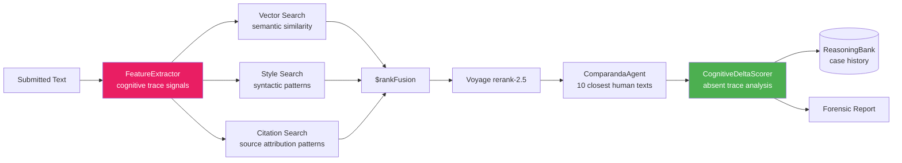

<div align="center">

# 👻 Blueprint 07: Ghostwriter Forensics

### Cognitive Trace Detection in AI-Written Text

[](.)
[](.)
[](.)

</div>

---

## The One-Line Pitch

*"Humans leave 'thinking scars' in their writing — hesitations, restarts, perspective shifts — that AI never generates. Ghostwriter Forensics detects their absence."*

---

## Problem Statement

AI detection tools (GPTZero, Originality.ai) work by spotting statistical patterns of AI text. They fail on edited AI text, non-native English writers, and paraphrased content. A fundamentally different approach: instead of looking for AI signatures, look for the *absence of human cognitive signatures*. Humans write with epistemic uncertainty ("I think", "it seems"), self-correction ("— or perhaps more precisely"), hedged attribution, and personal narrative anchors. These aren't decorative — they're traces of cognition. AI doesn't generate them organically. Ghostwriter Forensics retrieves the closest human-written comparanda from a reference corpus, computes the cognitive trace delta, and produces a forensic report.

---

## Architecture



---

## The Cognitive Trace Signals

These are the features FeatureExtractor computes for any input text:

| Signal | Human Pattern | AI Pattern | Weight |
|--------|--------------|------------|--------|
| **Epistemic markers** | "I think", "it seems", "arguably" | Rare, formulaic | 0.20 |
| **Self-correction patterns** | Em-dash restarts, "— or rather —" | Almost absent | 0.18 |
| **Perspective anchoring** | First-person epistemic position changes | Generic third-person | 0.15 |
| **Hedged attribution** | "According to X, though Y argues..." | Flat attribution | 0.12 |
| **Specificity gradient** | Detail density varies (high → low → high) | Uniform density | 0.12 |
| **Lexical fingerprint** | Idiosyncratic word choices | Near-average vocabulary | 0.10 |
| **Sentence rhythm entropy** | High variation in sentence length | Lower variation | 0.08 |
| **Logical connective type** | Causal, concessive, adversative mix | Mostly additive | 0.05 |

### CognitiveDeltaScore formula
```
delta = Σ weight_i × (human_baseline_i - input_score_i)
```
If `delta > threshold`: the text lacks cognitive traces present in human comparanda → AI-assisted flag.

---

## MongoDB Schema

### `reference_corpus` (human writing)
```json
{
  "_id": "ref_7821",
  "source": "academic_essay",
  "domain": "social_sciences",
  "text": "...",
  "embedding": [...],
  "cognitive_features": {
    "epistemic_marker_density": 0.034,
    "self_correction_count": 3,
    "perspective_shift_count": 5,
    "sentence_length_entropy": 2.41,
    "lexical_uniqueness_score": 0.62
  },
  "author_type": "human_verified",
  "word_count": 847
}
```

### `forensic_cases`
```json
{
  "_id": "case_2026_05_001",
  "submitted_text_hash": "sha256:abc123",
  "cognitive_delta_score": 0.73,
  "verdict": "HIGH_AI_PROBABILITY",
  "confidence": 0.84,
  "absent_traces": ["self_correction", "epistemic_markers"],
  "comparanda_ids": ["ref_7821", "ref_8834", "ref_9102"],
  "forensic_narrative": "The text is unusually uniform in detail density...",
  "valid_from": "2026-05-07T14:00:00Z"
}
```

---

## Agent Breakdown

### FeatureExtractor
- NLP pipeline: spaCy + custom rules for each cognitive signal
- Outputs a 8-dimensional feature vector
- Also computes Voyage AI embedding for semantic retrieval

### Adaptive Retrieval (3 paths)
- **Vector path**: semantic similarity — find human essays on similar topics
- **Style path**: Atlas Search with syntactic n-gram filters (sentence structure patterns)
- **Citation path**: how does this text attribute sources vs. human academic writing?

### ComparandaAgent
- Retrieves 10 closest human-written texts from reference corpus
- Computes the human baseline: mean cognitive feature vector for those 10 texts
- Passes baseline + input features to CognitiveDeltaScorer

### CognitiveDeltaScorer
- Computes delta per feature
- Generates natural language explanation: "This text has 0.003 epistemic markers per word; the 10 most similar human essays average 0.031 — a 10x difference"
- Stores case in `forensic_cases` with full provenance

### ReasoningBank (Persistent Learning)
- Over time: stores cases where verdict was later confirmed or refuted
- Updates feature weights via GRPO-style reward signal
- Bandit router learns which retrieval path finds the most discriminating comparanda

---

## Paper Anchors

| Paper | How It's Used |
|-------|--------------|
| **Search-R1** (arXiv:2503.09516) | RL-style adaptive retrieval: learn which comparanda path is most discriminating |
| **ReasoningBank** (arXiv:2504.09762) | Store verified cases; update feature weights over time |
| **Voyage rerank-2.5** | Rerank comparanda by stylistic similarity, not just semantic |
| Biber (1988) | Multidimensional analysis of register variation — basis for syntactic feature set |
| Hovy et al. (2013) | "Argumentation mining" — defines hedged attribution patterns |
| Mitchell et al. (2023) *DetectGPT* | Baseline approach (statistical); this work complements by targeting cognitive traces |

---

## MongoDB Atlas Building Blocks

```python
# Style-based retrieval: find human essays with similar syntactic patterns
def retrieve_by_style(syntactic_features: dict) -> list:
    pipeline = [
        {"$search": {
            "index": "style_index",
            "compound": {
                "should": [
                    {"range": {
                        "path": "cognitive_features.sentence_length_entropy",
                        "gte": syntactic_features["entropy"] - 0.3,
                        "lte": syntactic_features["entropy"] + 0.3
                    }},
                    {"range": {
                        "path": "cognitive_features.lexical_uniqueness_score",
                        "gte": syntactic_features["lexical"] - 0.1,
                        "lte": syntactic_features["lexical"] + 0.1
                    }}
                ],
                "filter": [{"text": {"query": "human_verified", "path": "author_type"}}]
            }
        }},
        {"$limit": 20}
    ]
    return list(db.reference_corpus.aggregate(pipeline))

# Compute cognitive delta score
def compute_delta(input_features: dict, comparanda: list) -> dict:
    WEIGHTS = {
        "epistemic_marker_density": 0.20,
        "self_correction_count": 0.18,
        "perspective_shift_count": 0.15,
        "sentence_length_entropy": 0.08,
        "lexical_uniqueness_score": 0.10
    }
    baseline = {k: sum(c["cognitive_features"][k] for c in comparanda) / len(comparanda)
                for k in WEIGHTS}
    delta = sum(w * max(0, baseline[k] - input_features.get(k, 0))
                for k, w in WEIGHTS.items())
    return {"score": round(delta, 3), "baseline": baseline}
```

---

## AWS Integration

| Service | Use |
|---------|-----|
| **Bedrock Claude Sonnet 4.6** | ForensicNarrative: explain the delta in plain language |
| **Bedrock Claude Haiku 4.5** | FeatureExtractor: process reference corpus at scale |
| **Lambda** | API endpoint for text submission + async result delivery |
| **S3** | Reference corpus storage (human essay archive) |
| **Bedrock Guardrails** | Never output "this was definitely AI-written" — always probabilistic |

---

## 90-Second Demo Script

**0:00** — Two essay snippets side by side: one clearly human, one submitted for analysis.

**0:12** — FeatureExtractor runs on both. Human essay: epistemic markers = 0.041/word, self-corrections = 4, sentence entropy = 2.67. Submitted text: 0.004, 0, 1.82.

**0:25** — 10 comparanda retrieved — human essays on the same topic (climate policy). Baseline established.

**0:38** — Cognitive Delta Score: **0.71** (threshold: 0.45 = HIGH AI PROBABILITY).

**0:48** — Feature breakdown shown as a radar chart. "Self-correction" and "epistemic markers" are nearly flat in the submitted text vs. the human baseline.

**1:00** — Forensic narrative: *"This text is unusually uniform in information density. The transitions between paragraphs use additive connectives ('furthermore', 'additionally') almost exclusively. The 10 most similar human essays use concessive and adversative connectives at 3× the rate."*

**1:15** — **The key point:** the system didn't look for AI patterns — it looked for what's *missing*. Works even if the text was rewritten or translated.

**1:25** — "Show me a known human essay" — system scores 0.09 (correct).

**1:30** — "Show me a known GPT-4 essay" — system scores 0.82 (correct).

---

## Build Order (48h Solo Plan)

| Hours | Task |
|-------|------|
| 0–10 | Reference corpus: seed 500 human essays from Project Gutenberg + academic sources |
| 10–18 | FeatureExtractor: 8 cognitive trace signals in spaCy |
| 18–28 | Hybrid retrieval: vector + style + citation paths |
| 28–36 | CognitiveDeltaScorer + ComparandaAgent |
| 36–44 | Forensic report generation + ReasoningBank |
| 44–48 | Demo interface + validation on 20 known human/AI essay pairs |

---

## Stretch Goals

1. **Domain calibration** — different domains (legal writing vs. creative fiction vs. news) have different human baselines; build domain-specific comparanda pools
2. **Author profile** — given 10 samples from a specific author, build their personal cognitive trace baseline and detect deviation
3. **Adversarial robustness** — test against "humanization" tools (Undetectable.ai) and show whether cognitive traces survive

---

## Navigation

| Previous | Home | Next |
|----------|------|------|
| [← Blueprint 06: ChronoLaw](06_chronolaw.md) | [🏠 10_Hackathons](../README.md) | [Blueprint 08: Exodus Mapper →](08_exodus_mapper.md) |
