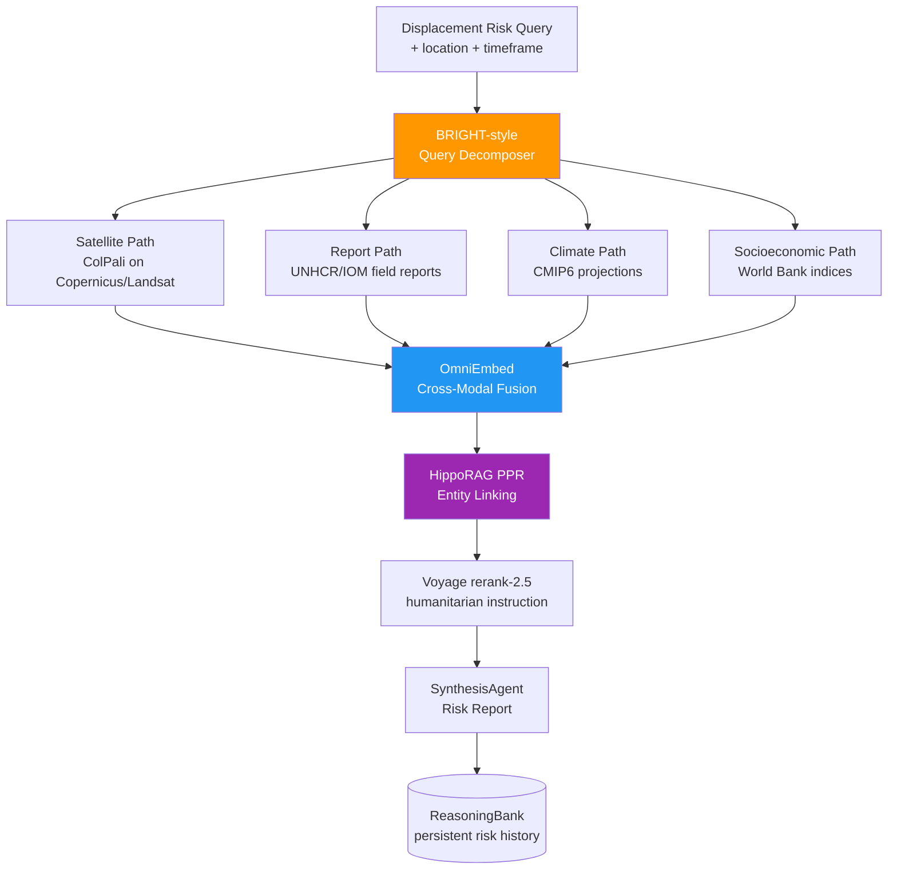

<div align="center">

# 🌍 Blueprint 08: Exodus Mapper

### Climate Displacement Multi-Source Adaptive Retrieval

[](.)
[](.)
[](.)

</div>

---

## The One-Line Pitch

*"Ask 'which communities in the Mekong Delta are at highest displacement risk by 2035?' and get an answer that fuses satellite salinity maps, UNHCR field reports, and climate projections — in one query."*

---

## Problem Statement

Climate displacement research is fragmented across incompatible data sources: satellite imagery (Copernicus, Landsat), qualitative field reports (UNHCR, IOM, Red Cross), peer-reviewed climate projections (CMIP6, IPCC), and socioeconomic vulnerability indices (World Bank). No single retrieval system bridges these modalities. Exodus Mapper uses adaptive retrieval to answer displacement risk queries by routing sub-questions to the right modality and fusing results with cross-modal evidence chains.

---

## Architecture



---

## MongoDB Schema

### `location_risk_nodes`
```json
{
  "_id": "mekong_delta_an_giang_province",
  "location_name": "An Giang Province, Vietnam",
  "coordinates": {"type": "Point", "coordinates": [105.12, 10.52]},
  "risk_score": 0.78,
  "risk_components": {
    "sea_level_rise_exposure": 0.85,
    "salinity_intrusion": 0.91,
    "socioeconomic_vulnerability": 0.62,
    "adaptive_capacity": 0.34
  },
  "displacement_projection_2035": 142000,
  "evidence_ids": ["sat_ev_221", "rep_ev_118", "clim_ev_304"],
  "valid_from": "2026-05-01T00:00:00Z"
}
```

### `evidence_nodes` (multi-modal)
```json
{
  "_id": "sat_ev_221",
  "modality": "satellite",
  "source": "Copernicus_Sentinel-2",
  "location_id": "mekong_delta_an_giang_province",
  "date": "2026-03-15",
  "embedding": [...],
  "finding": "Salinity front advanced 12km inland vs. 2020 baseline",
  "image_path": "s3://exodus-mapper/sentinel/2026/03/15/an_giang.tif"
}
```

---

## Agent Breakdown

### BRIGHT-style Query Decomposer
- Decomposes: "Which Mekong Delta communities are at risk by 2035?" into:
  1. "What is the current salinity intrusion level?" → Satellite path
  2. "What are UNHCR/IOM displacement reports from this region?" → Report path
  3. "What do CMIP6 projections show for sea level by 2035?" → Climate path
  4. "What is the socioeconomic vulnerability index?" → Socioeconomic path

### Satellite Path (ColPali)
- Copernicus Sentinel-2 + Sentinel-1 SAR images indexed with ColPali (no OCR/preprocessing)
- Query: salinity maps, flood extent maps, vegetation loss maps
- Returns page-level image embeddings that capture visual patterns without text

### Report Path (Dense + BM25)
- UNHCR, IOM, Red Cross field reports (PDF, multilingual)
- Voyage `multilingual-3` for cross-language retrieval (Khmer, Vietnamese, Bengali)
- BM25 for exact location names; dense for semantic similarity to displacement descriptions

### Climate Path (Structured + Vector)
- CMIP6 projection CSV data + IPCC AR6 report text
- Structured query: "sea level rise projection 2035, RCP 8.5, Mekong Delta"
- Vector: semantic search on climate risk assessment reports

### OmniEmbed Cross-Modal Fusion
- Projects all modalities into a shared semantic space
- Satellite image embedding + text embedding aligned via contrastive training
- Enables: "find locations where satellite shows flooding AND reports mention displacement"

### HippoRAG PPR Entity Linking
- Entities: locations, climate mechanisms, displacement drivers, vulnerable groups
- PPR from query location: finds related evidence across modalities via entity hops
- Example: An Giang Province → saline_intrusion mechanism → rice_yield_decline → food_insecurity → displacement_pressure

---

## Paper Anchors

| Paper | How It's Used |
|-------|--------------|
| **ColPali** (arXiv:2407.01449) | Satellite image indexing without preprocessing pipeline |
| **HippoRAG 2** (arXiv:2502.14802) | Multi-hop entity linking across modalities |
| **BRIGHT** (arXiv:2407.12883) | Reasoning-intensive decomposition of complex spatial queries |
| **Voyage multilingual-3** | Cross-language retrieval for Khmer, Vietnamese, Bengali field reports |
| **ReasoningBank** (arXiv:2504.09762) | Persist risk scores with provenance; update as new evidence arrives |
| IPCC AR6 WG2 Chapter 10 | Asia displacement projections — calibration ground truth |
| Black et al. (2011) | Migration and global environmental change: definitional framework |

---

## MongoDB Atlas Building Blocks

```python
# Geospatial query: find all high-risk locations within 100km of a query point
def get_nearby_high_risk(lat: float, lon: float, radius_km: float = 100) -> list:
    pipeline = [
        {
            "$geoNear": {
                "near": {"type": "Point", "coordinates": [lon, lat]},
                "distanceField": "distance_km",
                "maxDistance": radius_km * 1000,
                "spherical": True
            }
        },
        {"$match": {"risk_score": {"$gte": 0.6}}},
        {"$sort": {"risk_score": -1}},
        {"$limit": 20}
    ]
    return list(db.location_risk_nodes.aggregate(pipeline))

# Cross-modal fusion: find locations where satellite + reports agree on risk
def find_corroborated_risk(location_id: str) -> dict:
    evidence = list(db.evidence_nodes.find({
        "location_id": location_id,
        "valid_to": None
    }))
    
    modality_scores = {}
    for ev in evidence:
        modality = ev["modality"]
        if modality not in modality_scores:
            modality_scores[modality] = []
        # Extract risk signal from each piece of evidence
        modality_scores[modality].append(ev.get("risk_signal", 0.5))
    
    # Corroboration: all modalities agree = high confidence
    avg_scores = {k: sum(v)/len(v) for k, v in modality_scores.items()}
    corroboration = 1.0 - (max(avg_scores.values()) - min(avg_scores.values()))
    return {"modality_scores": avg_scores, "corroboration_score": corroboration}
```

---

## AWS Integration

| Service | Use |
|---------|-----|
| **Bedrock Claude Sonnet 4.6** | SynthesisAgent: generate risk report narrative with source citations |
| **Bedrock Claude Haiku 4.5** | BRIGHT decomposer: split query into sub-questions (high volume) |
| **S3** | Satellite image archive (Copernicus SAFE format) |
| **Lambda** | Satellite image pre-processing: band extraction before ColPali indexing |
| **Bedrock Guardrails** | Sensitivity controls: displacement data involves vulnerable populations |
| **Bedrock Knowledge Bases** | IPCC AR6 managed RAG with MongoDB Atlas connector |

---

## 90-Second Demo Script

**0:00** — Map of Southeast Asia. Query: *"Which communities in the Mekong Delta face the highest displacement risk by 2035?"*

**0:12** — BRIGHT decomposer splits into 4 sub-questions. Each sub-question routes to the appropriate modality.

**0:22** — Satellite results arrive: 3 Copernicus maps showing salinity intrusion progress 2018–2026. ColPali found these without any text — pure image matching.

**0:35** — Report results: 7 UNHCR field reports from 2024–2025. Two are in Vietnamese, one in Khmer — multilingual retrieval worked.

**0:45** — Climate results: CMIP6 RCP 8.5 projects 0.42m sea level rise by 2035 in the delta.

**0:55** — HippoRAG PPR: 4-hop chain from "An Giang Province" → "salinity intrusion" → "rice yield decline" → "food insecurity" → "displacement pressure" shown on map.

**1:05** — Top 5 highest-risk communities ranked by corroborated evidence. An Giang Province: risk score 0.78, corroboration score 0.91 (all 4 modalities agree).

**1:15** — Projected displacement by 2035: 142,000 people in the top 5 communities.

**1:25** — "All evidence links back to source. Click any finding to see the satellite image or field report."

---

## Build Order (48h Team Plan)

| Hours | Task | Person |
|-------|------|--------|
| 0–8 | MongoDB schema + seed Mekong Delta location data | Dev A |
| 0–8 | ColPali pipeline: index 50 Copernicus satellite images | Dev B |
| 8–20 | BRIGHT decomposer + bandit router | Dev A |
| 8–20 | Multilingual report retrieval (Voyage multilingual-3) | Dev B |
| 20–32 | OmniEmbed cross-modal fusion | Dev A |
| 20–32 | HippoRAG PPR entity linking | Dev B |
| 32–44 | SynthesisAgent + geospatial map visualization | Dev A + B |
| 44–48 | Demo rehearsal + edge cases | Dev A + B |

---

## Stretch Goals

1. **Real-time satellite update** — when a new Copernicus image is available, risk scores update automatically via Atlas Change Stream
2. **Migration corridor prediction** — model where displaced populations are likely to move (urban centers, border crossings)
3. **Policy brief generator** — auto-draft a 2-page UNHCR-format policy brief from the risk report

---

## Navigation

| Previous | Home | Next |
|----------|------|------|
| [← Blueprint 07: Ghostwriter Forensics](07_ghostwriter_forensics.md) | [🏠 10_Hackathons](../README.md) | [Blueprint 09: Protocol Darwin →](09_protocol_darwin.md) |
