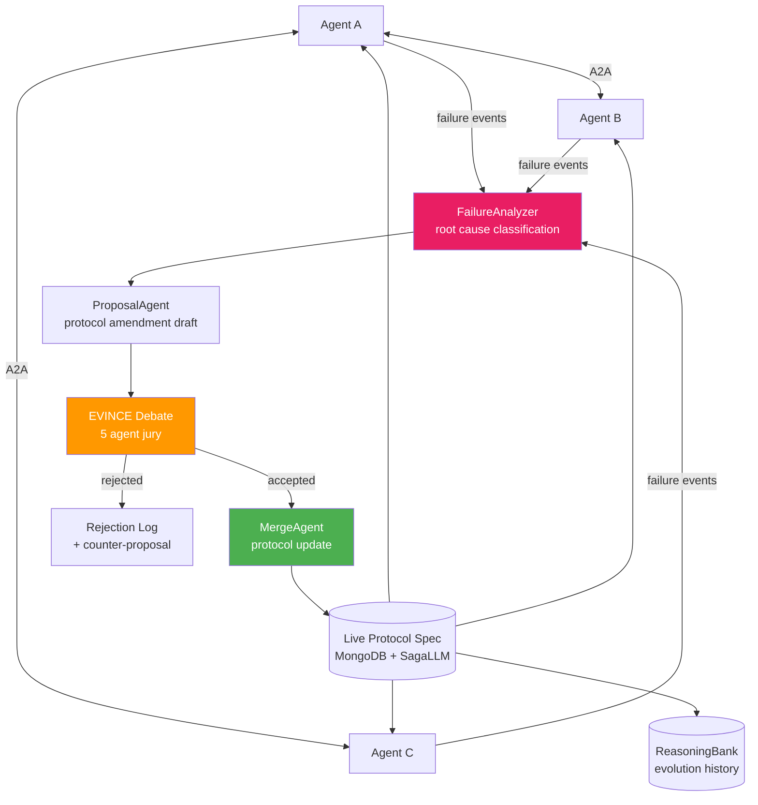

<div align="center">

# 🧬 Blueprint 09: Protocol Darwin

### Self-Evolving Protocol Specification from Agent Failures

[](.)
[](.)
[](.)

</div>

---

## The One-Line Pitch

*"Every time an agent fails to coordinate with another, the failure is analyzed, a protocol amendment is proposed, debated, and merged — the protocol evolves like living code."*

---

## Problem Statement

Multi-agent systems break when agents have incompatible assumptions about message format, task handoff timing, error handling, and capability advertisement. Today, engineers fix these by hand after each failure. Protocol Darwin automates this: when an agent interaction fails, a FailureAnalyzer agent diagnoses the root cause, a ProposalAgent drafts an amendment to the coordination protocol, the amendment goes through EVINCE debate, and if accepted, it's merged into the live protocol spec stored in MongoDB. The protocol literally evolves from real failures.

---

## Architecture



---

## MongoDB Schema

### `protocol_spec` (living document with version history)
```json
{
  "_id": "protocol_v47",
  "version": 47,
  "rules": [
    {
      "rule_id": "R-019",
      "text": "All task handoff messages MUST include an estimated_completion_time field",
      "rationale": "Failure #38: SchedulerAgent timed out waiting for response from ExecutorAgent because no ETA was provided",
      "added_in_version": 23,
      "failure_that_caused_it": "failure_ev_038"
    }
  ],
  "valid_from": "2026-05-07T14:00:00Z",
  "valid_to": null,
  "parent_version": "protocol_v46"
}
```

### `failure_events`
```json
{
  "_id": "failure_ev_038",
  "agents_involved": ["SchedulerAgent", "ExecutorAgent"],
  "failure_type": "timeout_no_ack",
  "a2a_message_log": [...],
  "root_cause": "missing_estimated_completion_time",
  "saga_compensation_applied": true,
  "compensation_action": "task_reassigned_to_backup_agent",
  "timestamp": "2026-05-07T13:45:00Z"
}
```

---

## Agent Breakdown

### Production Agents (3–5 agents running real tasks)
- Scheduler, Executor, Monitor, Validator — doing real work (e.g., code review pipeline)
- All A2A messages logged to MongoDB with full payload
- When an interaction fails, a failure event is emitted to Change Stream

### FailureAnalyzer
- Listens to failure Change Stream
- Classifies failure: timeout, malformed message, capability mismatch, state inconsistency, deadlock
- Root cause extraction: which rule in the current protocol was violated or missing?
- SagaLLM: if the failure caused a partial completion, identifies compensation actions

### ProposalAgent
- Drafts protocol amendment: new rule + rationale + example that would have prevented this failure
- Validates amendment doesn't conflict with existing rules (`$graphLookup` on rule dependency graph)
- Submits to EVINCE debate

### EVINCE Debate (Protocol Jury)
- 5 agents: Proposer, Skeptic, SecurityAudit, CompatibilityChecker, ImplementationReality
- Each evaluates the amendment from their perspective
- Convergence criterion: all 5 agents within 0.08 cosine distance of final position
- Rejection reasons stored — they become the counter-proposal seed

### MergeAgent (SagaLLM)
- Merges accepted amendment into live protocol spec
- SagaLLM compensation: if two amendments conflict, merges in version order with explicit rollback path
- Notifies all active agents of the protocol update via A2A broadcast
- Agents receive the update and self-patch their behavior (prompt context updated)

---

## Paper Anchors

| Paper | How It's Used |
|-------|--------------|
| **SagaLLM** (arXiv:2312.05382) | Failure compensation + multi-step protocol merge with rollback |
| **EVINCE debate** | Protocol jury: 5-agent convergence on amendment acceptance |
| **A2A Protocol** (Google 2025) | The protocol being evolved; capability advertisement in agent cards |
| **MCP** (Anthropic 2024) | Tool definition protocol that Protocol Darwin extends to agent coordination |
| **ReasoningBank** (arXiv:2504.09762) | Evolution history: which failures led to which rules |
| **Zep temporal KG** (arXiv:2501.13956) | Bi-temporal protocol versioning (valid_from/valid_to on each rule) |
| Lamport (1998) *The Part-Time Parliament* | Consensus-based protocol design — theoretical foundation |

---

## MongoDB Atlas Building Blocks

```python
# Check amendment compatibility with existing rules
def check_amendment_compatibility(new_rule: dict, current_protocol: dict) -> dict:
    pipeline = [
        {"$match": {"_id": current_protocol["_id"]}},
        {"$unwind": "$rules"},
        {"$graphLookup": {
            "from": "rule_dependencies",
            "startWith": "$rules.rule_id",
            "connectFromField": "rule_id",
            "connectToField": "depends_on",
            "as": "dependents"
        }},
        # Check if new rule text conflicts semantically with any dependent
        {"$addFields": {
            "conflict_risk": {
                "$cond": {
                    "if": {"$gt": [{"$size": "$dependents"}, 0]},
                    "then": "POTENTIAL_CONFLICT",
                    "else": "CLEAR"
                }
            }
        }}
    ]
    return list(db.protocol_spec.aggregate(pipeline))

# Track protocol evolution: which failures caused which rules?
def get_evolution_lineage(rule_id: str) -> list:
    pipeline = [
        {"$match": {"rules.rule_id": rule_id}},
        {"$graphLookup": {
            "from": "failure_events",
            "startWith": "$rules.failure_that_caused_it",
            "connectFromField": "_id",
            "connectToField": "_id",
            "as": "failure_chain"
        }}
    ]
    return list(db.protocol_spec.aggregate(pipeline))
```

---

## AWS Integration

| Service | Use |
|---------|-----|
| **Bedrock Claude Opus 4.7** | ProposalAgent: draft complex protocol amendments requiring deep reasoning |
| **Bedrock Claude Sonnet 4.6** | EVINCE debate agents: evaluate amendments from different perspectives |
| **Bedrock Claude Haiku 4.5** | FailureAnalyzer: classify failure types at high volume |
| **Lambda** | Change Stream consumer: trigger FailureAnalyzer on each failure event |
| **Step Functions** | Orchestrate EVINCE debate with timeout and escalation path |
| **EventBridge** | Broadcast protocol updates to all active agents |
| **S3** | Archive full A2A message logs for post-hoc analysis |

---

## 90-Second Demo Script

**0:00** — Live dashboard: 4 agents running a code review pipeline. Scheduler, Fetcher, Analyzer, Reporter.

**0:10** — **Failure event:** Analyzer times out waiting for Fetcher. SagaLLM: task reassigned to backup Fetcher. System continues.

**0:20** — FailureAnalyzer activates. Root cause: Fetcher's capability card didn't advertise `max_file_size_mb` — Analyzer tried to hand off a 450MB file.

**0:32** — ProposalAgent drafts Rule R-048: *"Capability cards MUST include resource_limits.max_payload_mb for any file-handling agent."*

**0:44** — EVINCE debate starts. 5 agents evaluate. Skeptic: "What if the agent doesn't know its own memory limit?" ImplementationReality: "Add a default of 100MB if unspecified." Convergence in 3 rounds (entropy 1.4 → 0.07).

**1:00** — Amendment accepted. MergeAgent applies it. Protocol goes from v46 to v47. All agents receive the update via A2A broadcast.

**1:10** — **Replay:** same failure scenario run again. Analyzer checks capability card first. 450MB file → capability check fails gracefully → file chunked automatically. No timeout.

**1:22** — Protocol evolution timeline shown: 47 versions, 38 failure events, 41 rules added. The system learned from every failure.

**1:30** — "The protocol is now smarter than when we started — and we never wrote a single rule manually."

---

## Build Order (72h Team Plan)

| Hours | Task | Person |
|-------|------|--------|
| 0–8 | MongoDB schema + 4-agent code review pipeline | Dev A |
| 0–8 | A2A message logging + failure event schema | Dev B |
| 8–20 | FailureAnalyzer: 6 failure type classifiers | Dev A |
| 8–20 | SagaLLM compensation for each failure type | Dev B |
| 20–32 | ProposalAgent: amendment draft + compatibility check | Dev A |
| 20–32 | EVINCE debate module with 5-agent jury | Dev B |
| 32–44 | MergeAgent: protocol version control + agent broadcast | Dev A |
| 32–44 | ReasoningBank: evolution history + lineage graph | Dev B |
| 44–60 | End-to-end: inject 10 deliberate failures, watch evolution | Dev A + B |
| 60–72 | Demo rehearsal + evolution timeline visualization | Dev A + B |

---

## Stretch Goals

1. **Cross-system export** — export the evolved protocol as an OpenAPI-compatible spec that other teams can adopt
2. **Failure prediction** — given a new agent's capability card, predict which existing rules it might violate before first deployment
3. **Rollback test** — demonstrate SagaLLM rolling back a bad amendment that broke inter-agent coordination

---

## Navigation

| Previous | Home | Next |
|----------|------|------|
| [← Blueprint 08: Exodus Mapper](08_exodus_mapper.md) | [🏠 10_Hackathons](../README.md) | [Blueprint 10: Carbon Lie Detector →](10_carbon_lie_detector.md) |
