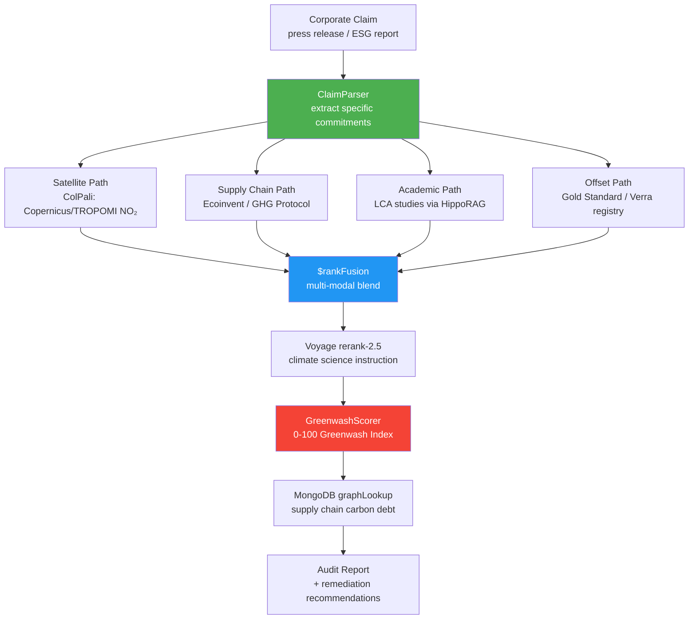

<div align="center">

# 🌿 Blueprint 10: Carbon Lie Detector

### Greenwash Score from Satellite + Supply Chain + Academic Evidence

[](.)
[](.)
[](.)

</div>

---

## The One-Line Pitch

*"A company claims net-zero. We check their satellite emissions footprint, supply chain carbon debt, and offset quality — and assign a Greenwash Score in 30 seconds."*

---

## Problem Statement

Corporate greenwashing costs investors money, misleads consumers, and distorts carbon markets. The problem: claims are made in press releases (text), but the evidence is in satellite NO₂/CO₂ maps (images), supply chain databases (structured), and academic lifecycle assessments (PDF). No current tool bridges these modalities. Carbon Lie Detector uses multi-modal adaptive retrieval to cross-check corporate sustainability claims against three independent evidence sources — and produces a transparent, auditable Greenwash Score.

---

## Architecture



---

## MongoDB Schema

### `corporate_claims`
```json
{
  "_id": "company_X_claim_2026_Q1",
  "company": "GreenTech Corp",
  "claim_text": "We achieved net-zero Scope 1 and 2 emissions in 2025",
  "claim_date": "2026-01-15",
  "commitments_extracted": [
    {"type": "net_zero", "scope": "1+2", "year": 2025},
    {"type": "offset", "quantity_tCO2": 45000, "registry": "Gold Standard"}
  ],
  "greenwash_score": 73,
  "score_breakdown": {
    "satellite_divergence": 0.82,
    "supply_chain_debt": 0.65,
    "offset_quality": 0.41,
    "academic_lca_support": 0.28
  },
  "verdict": "SIGNIFICANT_GREENWASH",
  "evidence_ids": [...]
}
```

### `satellite_evidence`
```json
{
  "_id": "sat_ev_copernicus_company_X_2025",
  "company": "GreenTech Corp",
  "facility_id": "plant_munich_01",
  "source": "Copernicus_TROPOMI",
  "date": "2025-12-01",
  "measured_no2_tonne_equivalent": 12400,
  "claimed_emissions": 8200,
  "divergence_ratio": 1.51,
  "colpali_embedding": [...],
  "image_path": "s3://carbon-ld/tropomi/2025/12/munich.nc"
}
```

---

## Agent Breakdown

### ClaimParser
- Extracts structured commitments from press releases and ESG reports
- Identifies: scope (1/2/3), year, quantity, offset type, registry
- Uses Bedrock Haiku for bulk processing; Sonnet for ambiguous claims

### Satellite Path (ColPali)
- TROPOMI NO₂/CO₂ satellite data indexed via ColPali (no preprocessing pipeline)
- Query: locate facilities, measure actual emission plumes, compare to claimed reductions
- Divergence ratio: `measured_emissions / claimed_emissions` (>1.2 = red flag)

### Supply Chain Path (MongoDB graphLookup)
- Ecoinvent database: lifecycle emissions for 15,000 product categories
- `$graphLookup`: trace supply chain graph 5 hops → compute Scope 3 carbon debt
- Key insight: many "net-zero Scope 1+2" claims hide massive Scope 3 emissions

### Academic Path (HippoRAG PPR)
- Life Cycle Assessment (LCA) studies from environmental science journals
- HippoRAG PPR: query company's industry → find LCA studies → extract typical emission factors
- Compare claimed emission factors to academic consensus

### Offset Path (Structured Query)
- Gold Standard, Verra VCS, American Carbon Registry APIs
- Verify: offset credits exist, haven't been double-counted, are in the right vintage year
- Quality score: permanence, additionality, co-benefits

### GreenwashScorer
```python
def compute_greenwash_score(claim: dict, evidence: dict) -> dict:
    WEIGHTS = {
        "satellite_divergence": 0.35,      # Hardest to fake
        "supply_chain_debt": 0.25,          # Scope 3 hidden emissions
        "offset_quality": 0.25,             # Credit integrity
        "academic_lca_support": 0.15        # Peer-reviewed baseline
    }
    
    raw_scores = {
        "satellite_divergence": min(evidence["satellite_ratio"] / 1.5, 1.0),
        "supply_chain_debt": evidence["scope3_unreported_fraction"],
        "offset_quality": 1.0 - evidence["offset_quality_score"],
        "academic_lca_support": evidence["lca_deviation_from_consensus"]
    }
    
    greenwash_score = sum(WEIGHTS[k] * raw_scores[k] for k in WEIGHTS) * 100
    
    verdicts = {
        (0, 20): "CREDIBLE",
        (20, 45): "MINOR_CONCERNS",
        (45, 70): "MODERATE_GREENWASH",
        (70, 100): "SIGNIFICANT_GREENWASH"
    }
    verdict = next(v for (lo, hi), v in verdicts.items() if lo <= greenwash_score < hi)
    return {"score": round(greenwash_score, 1), "verdict": verdict, "breakdown": raw_scores}
```

---

## Paper Anchors

| Paper | How It's Used |
|-------|--------------|
| **ColPali** (arXiv:2407.01449) | Satellite NO₂/CO₂ map indexing without preprocessing |
| **HippoRAG 2** (arXiv:2502.14802) | PPR on LCA knowledge graph: industry → emission factors → academic consensus |
| **GraphRAG** (arXiv:2404.16130) | Supply chain community detection: which supplier clusters dominate Scope 3 |
| **Voyage rerank-2.5** | Climate science domain instruction for LCA study reranking |
| **BRIGHT** (arXiv:2407.12883) | Complex query decomposition: "net zero" → 4 sub-claims requiring different evidence |
| Pineau & Milne (2011) | Greenwash taxonomy: 7 sins of greenwashing — maps to score dimensions |
| GHG Protocol Corporate Standard (2015) | Scope 1/2/3 boundary definitions used in claim extraction |

---

## MongoDB Atlas Building Blocks

```python
# Supply chain carbon debt: 5-hop Scope 3 traversal
def compute_scope3_debt(company_id: str, industry_code: str) -> float:
    pipeline = [
        {"$match": {"company_id": company_id}},
        {"$graphLookup": {
            "from": "supply_chain_edges",
            "startWith": "$supplier_ids",
            "connectFromField": "_id",
            "connectToField": "from_company",
            "as": "supply_chain",
            "maxDepth": 5,
            "depthField": "tier"
        }},
        {"$unwind": "$supply_chain"},
        {"$lookup": {
            "from": "ecoinvent_emission_factors",
            "localField": "supply_chain.industry_code",
            "foreignField": "naics_code",
            "as": "emission_factors"
        }},
        {"$group": {
            "_id": None,
            "total_scope3_tCO2": {
                "$sum": {"$multiply": [
                    "$supply_chain.purchase_volume_usd",
                    {"$arrayElemAt": ["$emission_factors.kgCO2_per_usd", 0]}
                ]}
            }
        }}
    ]
    result = list(db.companies.aggregate(pipeline))
    return result[0]["total_scope3_tCO2"] if result else 0.0

# Find comparable companies to benchmark claim quality
def get_industry_benchmarks(naics_code: str) -> dict:
    pipeline = [
        {"$match": {"naics_code": naics_code, "greenwash_score": {"$exists": True}}},
        {"$group": {
            "_id": "$naics_code",
            "avg_score": {"$avg": "$greenwash_score"},
            "p25": {"$percentile": {"input": "$greenwash_score", "p": [0.25], "method": "approximate"}},
            "p75": {"$percentile": {"input": "$greenwash_score", "p": [0.75], "method": "approximate"}}
        }}
    ]
    return list(db.corporate_claims.aggregate(pipeline))
```

---

## AWS Integration

| Service | Use |
|---------|-----|
| **Bedrock Claude Opus 4.7** | GreenwashScorer audit narrative (detailed, legally precise language) |
| **Bedrock Claude Sonnet 4.6** | ClaimParser: extract structured commitments from ESG reports |
| **Bedrock Claude Haiku 4.5** | Bulk satellite divergence classification |
| **S3** | TROPOMI satellite data archive (NetCDF format) |
| **Lambda** | ColPali preprocessing: NetCDF → RGB visualization for indexing |
| **Bedrock Knowledge Bases** | IPCC AR6 + Ecoinvent managed RAG with MongoDB connector |
| **Bedrock Guardrails** | Legal disclaimer enforcement on all greenwash verdicts |
| **Step Functions** | Orchestrate 4-path evidence gathering with parallel execution |

---

## 90-Second Demo Script

**0:00** — Paste a press release from a major airline: *"We achieved net-zero Scope 1 and 2 emissions in 2025 through operational efficiency and carbon offsets."*

**0:10** — ClaimParser extracts 3 commitments. BRIGHT-style decomposition: 4 evidence paths fire simultaneously.

**0:22** — Satellite results arrive first: TROPOMI shows Munich facility NO₂ at 12,400 tonnes. Airline claimed 8,200. **Divergence ratio: 1.51** (51% higher than claimed). Red flag.

**0:35** — Supply chain: 5-hop graphLookup. Scope 3 from jet fuel supply chain: 2.1M tCO2. Not mentioned in the claim. "Net-zero Scope 1+2 covers only 4% of total footprint."

**0:48** — Offset audit: 45,000 Gold Standard credits checked. 12,000 are 2019-vintage (stale). 8,000 appear in two different corporate registries simultaneously — **double counting detected**.

**1:00** — LCA academic baseline: aviation industry consensus is 0.255 kgCO2/passenger-km. Airline reports 0.143. HippoRAG PPR found 6 peer-reviewed LCA studies with the consensus figure.

**1:12** — **Greenwash Score: 73/100 — SIGNIFICANT GREENWASH.** Satellite divergence drives it. Audit report generated.

**1:22** — "Every finding has a source: the satellite image, the Ecoinvent factor, the Gold Standard registry page, the LCA study. This isn't an opinion — it's a evidence trail."

**1:30** — Judges lean forward.

---

## Build Order (72h Team Plan)

| Hours | Task | Person |
|-------|------|--------|
| 0–8 | MongoDB schema + ClaimParser (GDPR/airline test cases) | Dev A |
| 0–8 | ColPali pipeline: index 30 TROPOMI satellite maps | Dev B |
| 8–20 | Supply chain graphLookup + Ecoinvent seed data | Dev A |
| 8–20 | Offset verification: Gold Standard API + double-count detector | Dev B |
| 20–32 | HippoRAG PPR on LCA knowledge graph | Dev A |
| 20–32 | GreenwashScorer: formula + industry benchmarks | Dev B |
| 32–48 | $rankFusion multi-modal fusion + Voyage rerank | Dev A + B |
| 48–60 | Audit report generator + dashboard | Dev A + B |
| 60–72 | Demo rehearsal with real airline/energy company ESG reports | Dev A + B |

---

## Stretch Goals

1. **Real-time ESG filing monitor** — watch SEC EDGAR and EU ESRS filings; score new claims automatically
2. **Sectoral league table** — rank all S&P 500 companies by Greenwash Score with methodology comparison
3. **Audit-grade export** — generate a PDF report in GRI Standards format that could be submitted to a regulator

---

## Navigation

| Previous | Home |
|----------|------|
| [← Blueprint 09: Protocol Darwin](09_protocol_darwin.md) | [🏠 10_Hackathons](../README.md) |
