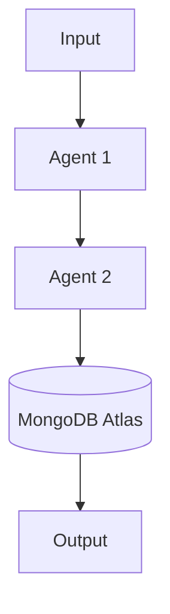

# 💡 Hackathon Idea Template

> Copy this template for each new idea. Keep each idea under 25 lines in the theme `ideas.md` files.  
> For deep dives, expand every section fully (~300–400 lines).

---

## 🔬 #N — TITLE HERE
**Domain:** Industry Vertical | **Difficulty:** ⭐⭐⭐ | **Time Budget:** 48h | **Team Size:** 2–3

---

### Hook
> One sentence. Should make a judge lean forward. Start with a number or a named problem.

*Example: "FDA was late on 73.9% of recall terminations — this agent closes that gap."*

---

### Problem Statement
What breaks today? Who feels the pain? Why do existing tools fail?

---

### Why Now (2025–2026 Context)
What changed recently that makes this buildable and relevant?
- New paper / model / API that enables it
- Recent industry event that proves the pain point
- Regulatory / market shift that makes it urgent

---

### Academic Foundations

| Paper | Authors | Year | Key Contribution | Why It Matters Here |
|-------|---------|------|-----------------|---------------------|
| [Title (arXiv:XXXX.XXXXX)](https://arxiv.org/abs/XXXX.XXXXX) | Authors | 2025 | What the paper proves | How you use it |

---

### Concept
- **Agent 1**: what it does, what it sees, what it outputs
- **Agent 2**: what it does, what it sees, what it outputs
- **Coordination**: how agents communicate (A2A / MongoDB blackboard / change streams)
- **Learning loop**: how the system improves over time (ReasoningBank / DPO / bandit)

---

### Architecture Diagram



---

### MongoDB Atlas Schema

```json
// collection_name
{
  "_id": "uuid",
  "field_1": "value",
  "embeddings": [0.1, 0.2, "..."],
  "valid_from": "ISODate",
  "valid_to": "ISODate or null"
}
```

**Collections needed:**
- `memories` — episodic/semantic memory store
- `checkpoints` — LangGraph agent state
- `reasoning_bank` — distilled lessons

---

### AWS Service Map

| Service | Role |
|---------|------|
| Bedrock (Claude 3.5 Sonnet) | Core reasoning |
| Lambda | Event-triggered agent steps |
| EventBridge | Scheduled sleep-time consolidation |
| S3 | Artifact storage |
| MongoDB Atlas | All persistent state |

---

### 90-Second Demo Script

| Time | Action | What the Audience Sees |
|------|--------|----------------------|
| 00:00 | Opening stake | The one number that makes them feel it |
| 00:15 | Inject the problem | Drop the input that triggers the agent |
| 00:40 | Live demo moment | The thing that makes them gasp |
| 01:10 | "How it works" | One architectural insight |
| 01:25 | Learning signal | ReasoningBank entry appearing / nDCG climbing |
| 01:40 | Closing | Stakes re-anchored. What would have failed without this? |

---

### Judging Rubric Fit

| Criterion | Weight | How This Idea Scores |
|-----------|--------|---------------------|
| Innovation / Creativity | 35% | |
| Technical Depth | 25% | |
| Demo Polish | 25% | |
| Business / Social Impact | 15% | |

---

### Stretch Goals

| Tier | Goal |
|------|------|
| **6-hour stretch** | Add X to make demo more interactive |
| **24-hour stretch** | Integrate Y for production viability |
| **1-week stretch** | Productionize with Z |

---

### Failure Modes & Mitigations

| Risk | Probability | Mitigation |
|------|-------------|------------|
| API rate limits during demo | Medium | Pre-seed MongoDB with demo dataset |
| Model latency spikes | Medium | Pre-compute expensive steps, stream results |
| Live data source unavailable | Low | Fall back to cached snapshot |

---

### Estimated Cost (48h hackathon)

- MongoDB Atlas M10: ~$0.08/hr × 48h = **~$4**
- AWS Bedrock (Claude 3.5 Sonnet): ~$0.003/1K output tokens × estimated usage = **~$5–15**
- AWS Lambda + S3: **free tier sufficient**
- **Total: ~$10–20 for a full hackathon**

---

### Reference Repos & Resources

- [Paper on arXiv](https://arxiv.org/abs/XXXX.XXXXX)
- [MongoDB Atlas Vector Search docs](https://www.mongodb.com/docs/atlas/atlas-vector-search/)
- [LangGraph MongoDB checkpointer](https://langchain-ai.github.io/langgraph/)
- [AWS Bedrock docs](https://docs.aws.amazon.com/bedrock/)
- Related deep dive: [deep_dive_ideas/](../deep_dive_ideas/)
