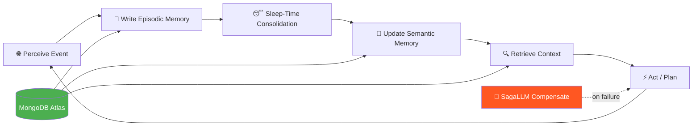

<div align="center">

# 🧠 Theme 1: Prolonged Coordination

### Agents That Survive Weeks, Months, and Years

[](ideas.md)
[](.)
[](.)

</div>

---

## What Makes This Theme Different

Every other agent demo runs for 90 seconds. These agents run for 90 days.

The core insight: **most real-world problems have timescales that dwarf any single session**. A patent prosecution lasts 4 years. A clinical trial site activation takes 7 months. A wildfire season runs 90 days. Current AI tools treat these as a series of disconnected sessions — losing context, repeating themselves, and failing at the handoff.

Prolonged Coordination agents solve this with three mechanisms:

| Mechanism | What It Does | MongoDB Role |
|-----------|-------------|-------------|
| **Episodic Memory** | Stores every event in chronological order with timestamps | Time-series or change-stream-triggered inserts |
| **Sleep-Time Consolidation** | Compresses episodes into semantic memory overnight | EventBridge → Lambda → Atlas aggregation pipeline |
| **Durable Execution** | Persists agent state across crashes, restarts, and long gaps | LangGraph MongoDB checkpointer |

And when something goes wrong:

| Mechanism | What It Does | MongoDB Role |
|-----------|-------------|-------------|
| **SagaLLM Compensation** | Rolls back or compensates failed long-running steps | Saga ledger collection with compensation callbacks |
| **Bi-temporal Validity** | Tracks what was true *when* (valid_from / valid_to) | Document-level temporal metadata |

---

## Mental Model



---

## Anchor Papers

| Paper | Key Contribution | Use in Hackathon |
|-------|-----------------|-----------------|
| **ReasoningBank** ([arXiv:2504.09762](https://arxiv.org/abs/2504.09762)) | Distills successful reasoning traces into a reusable memory bank that persists across agent restarts | Use as the "what worked before" layer — agent learns from past successful runs |
| **MIRIX** (multi-memory architecture) | Five distinct memory types: episodic, semantic, procedural, working, and resource — each with different decay and retrieval characteristics | Design your MongoDB schema to separate these types; don't store everything in one collection |
| **Zep Temporal KG** ([arXiv:2501.13956](https://arxiv.org/abs/2501.13956)) | Bi-temporal knowledge graph where every fact has `valid_from` and `valid_to` — enables "what did the agent believe on March 15?" | Use for any scenario where beliefs or states change over time |
| **SagaLLM** ([arXiv:2312.05382](https://arxiv.org/abs/2312.05382)) | Extends Saga pattern to LLM agents — each step has a compensating action so long-running processes can safely roll back | Use when your agent takes irreversible real-world actions (file a form, send an email, update a record) |
| **VIGIL** (reflective supervisor) | A sibling agent monitors the primary agent's outputs and flags potential miscorrelations or drift before they propagate | Use for high-stakes scenarios where errors compound over time |

---

## Common Building Blocks

### MongoDB TTL-Based Episodic Archival
```javascript
// Create TTL index to archive raw episodes after 90 days
db.episodes.createIndex(
  { "timestamp": 1 },
  { expireAfterSeconds: 7776000 }  // 90 days
)
// Consolidated summaries in separate collection never expire
```

### LangGraph MongoDB Checkpointer
```python
from langgraph.checkpoint.mongodb import MongoDBSaver

checkpointer = MongoDBSaver.from_conn_string(
    conn_string=os.environ["MONGODB_URI"],
    db_name="agent_state",
    collection_name="checkpoints"
)
graph = graph_builder.compile(checkpointer=checkpointer)
```

### Sleep-Time Consolidation (EventBridge → Lambda)
```python
# Lambda triggered at 3am daily by EventBridge rule
def consolidate_memories(event, context):
    episodes = db.episodes.find({"consolidated": False})
    summary = llm.invoke(f"Summarize and extract key insights: {list(episodes)}")
    db.semantic_memory.insert_one({"summary": summary, "consolidated_at": datetime.now()})
    db.episodes.update_many({"consolidated": False}, {"$set": {"consolidated": True}})
```

### Bi-Temporal Schema Pattern
```json
{
  "_id": "claim_001",
  "content": "Patent claim: novel compound X",
  "valid_from": "2024-03-01T00:00:00Z",
  "valid_to": null,
  "created_at": "2024-03-01T09:15:00Z",
  "superseded_by": null
}
```

---

## Quick-Pick Guide

| Your Situation | Recommended Ideas |
|----------------|-------------------|
| Solo, 24h, want to win | #9 EvergreenIDE · #29 PaperShepherd · #21 HarvestChain |
| Team of 2-3, 48h, healthcare domain | #2 NemoRecall · #3 SiteAct · #17 SubmissionShepherd |
| Team, want max "wow" | Deep Dives: ChronoLaw · Portfall · Tipping Oracle |
| First hackathon, want to finish | #10 GrantOrbit · #21 HarvestChain · #30 PenguinPipe |
| Strong infra/backend skills | #4 QueueClear · #33 ProvAgentX · #5 CampaignChem |

---

## Index of All 33 Ideas

| # | Title | Domain | Difficulty | Time Budget | Primary Paper |
|---|-------|--------|-----------|-------------|---------------|
| 1 | ProsecuteIQ | Legal / IP | ⭐⭐⭐⭐ | 1 week | SagaLLM + Zep |
| 2 | NemoRecall | Healthcare / Regulatory | ⭐⭐⭐ | 48h | SagaLLM |
| 3 | SiteAct | Healthcare Research | ⭐⭐⭐ | 48h | SagaLLM |
| 4 | QueueClear | Climate / Energy | ⭐⭐⭐⭐ | 1 week | VIGIL |
| 5 | CampaignChem | Materials Science | ⭐⭐⭐⭐⭐ | 1 week | ReasoningBank |
| 6 | APT-Hunter | Cybersecurity | ⭐⭐⭐⭐ | 48h | VIGIL + ReasoningBank |
| 7 | AuditLong | Compliance | ⭐⭐⭐ | 48h | Zep |
| 8 | MarketWatch13F | Finance | ⭐⭐⭐ | 48h | Zep |
| 9 | EvergreenIDE | Developer Tools | ⭐⭐⭐ | 48h | ReasoningBank |
| 10 | GrantOrbit | Government / Research | ⭐⭐ | 24h | SagaLLM |
| 11 | TelescopeNight | Space / Astronomy | ⭐⭐⭐⭐ | 1 week | ReasoningBank |
| 12 | BiobankShepherd | Healthcare Research | ⭐⭐⭐ | 48h | SagaLLM + MIRIX |
| 13 | ClaimsMarathon | Insurance | ⭐⭐⭐ | 48h | SagaLLM |
| 14 | Reef-Witness | Climate / Conservation | ⭐⭐⭐ | 48h | MIRIX |
| 15 | NEPA-Reviewer | Government / Permitting | ⭐⭐⭐⭐ | 1 week | Zep |
| 16 | CrystalCampaign | Scientific Research | ⭐⭐⭐⭐ | 1 week | ReasoningBank |
| 17 | SubmissionShepherd | Healthcare Regulatory | ⭐⭐⭐ | 48h | ReasoningBank |
| 18 | WildfireWatch | Climate / Disaster | ⭐⭐⭐⭐ | 48h | MIRIX |
| 19 | PreFlightOrbit | Aerospace | ⭐⭐⭐⭐ | 1 week | VIGIL |
| 20 | CodexPapyrus | Cultural Heritage | ⭐⭐⭐ | 48h | ReasoningBank |
| 21 | HarvestChain | Agriculture | ⭐⭐ | 24h | MIRIX |
| 22 | PolicyMarathon | Legal / Compliance | ⭐⭐⭐ | 48h | Zep |
| 23 | MAUDEHunter | Healthcare Research | ⭐⭐⭐⭐ | 48h | ReasoningBank |
| 24 | MA-Diligence | Finance | ⭐⭐⭐⭐ | 1 week | Zep + SagaLLM |
| 25 | StableYear | Healthcare Research | ⭐⭐⭐ | 48h | MIRIX |
| 26 | AuditAgentTax | Finance / Government | ⭐⭐⭐⭐ | 1 week | SagaLLM |
| 27 | PortfolioGardener | Finance | ⭐⭐⭐ | 48h | Zep |
| 28 | ProcessLoom | Manufacturing | ⭐⭐⭐ | 48h | VIGIL |
| 29 | PaperShepherd | Scientific Publishing | ⭐⭐ | 24h | ReasoningBank |
| 30 | PenguinPipe | Conservation | ⭐⭐ | 24h | MIRIX |
| 31 | RFISprint | Construction | ⭐⭐⭐ | 48h | SagaLLM |
| 32 | AdverseShield | Insurance | ⭐⭐⭐⭐ | 1 week | SagaLLM |
| 33 | ProvAgentX | Cybersecurity | ⭐⭐⭐⭐⭐ | 1 week | VIGIL + ReasoningBank |

---

## Navigation

| Previous | Home | Next |
|----------|------|------|
| [← 10_Hackathons](../README.md) | [🏠 README](../../README.md) | [All 33 Ideas →](ideas.md) |
