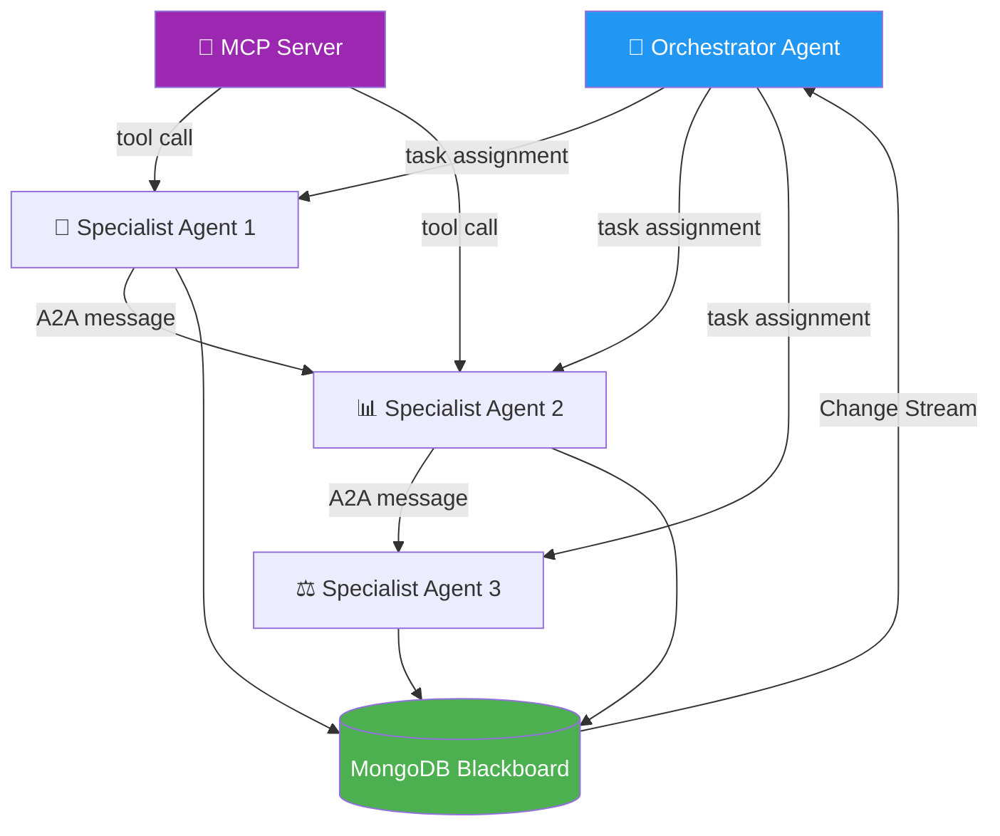

<div align="center">

# 🤝 Theme 2: Multi-Agent Collaboration

### Swarms, Orchestrators, and the A2A Protocol

[](ideas.md)
[](.)
[](.)

</div>

---

## What Makes This Theme Different

Single agents hit ceiling problems: context limits, single specialization, no cross-organizational trust. Multi-agent systems break through these ceilings by distributing responsibility — but coordination itself becomes the hard problem.

This theme is about **how agents talk to each other** as much as what they do:

| Pattern | What It Solves | When to Use |
|---------|---------------|------------|
| **A2A Protocol** | Standardized agent-to-agent message format with capability discovery | Cross-organization or cross-domain agent communication |
| **MCP (Model Context Protocol)** | Standardized tool/resource exposure — agents discover capabilities via `.well-known` | When agents need to use tools from external servers |
| **Shared Blackboard** | MongoDB collection all agents read/write; events propagate via Change Streams | When agents need shared situational awareness |
| **EVINCE Debate** | Entropy-governed multi-agent debate with a convergence stopping criterion | When no single agent is authoritative; consensus needed |
| **Magentic-One Orchestration** | Orchestrator assigns tasks to specialist agents; tracks progress globally | When specialists exist but coordination is complex |

---

## Mental Model



---

## Anchor Papers

| Paper | Key Contribution | Use in Hackathon |
|-------|-----------------|-----------------|
| **A2A Protocol** (Google, 2025) | Open standard for agent-to-agent communication; agents announce capabilities via Agent Cards; tasks negotiated with structured messages | Build your inter-agent API around this spec — judges will recognize it |
| **MCP** (Anthropic, Nov 2024) | Model Context Protocol — standardized tool and resource exposure; `.well-known/mcp.json` for discovery | Use MCP servers for external tools; build your own for your domain data |
| **Magentic-One** ([arXiv:2411.04468](https://arxiv.org/abs/2411.04468)) | Generalist orchestrator + WebSurfer + FileSurfer + Coder + ComputerTerminal specialist agents; orchestrator tracks global progress | Adapt the orchestrator pattern; swap in domain specialists |
| **AutoGen v0.4** ([arXiv:2308.08155](https://arxiv.org/abs/2308.08155)) | Actor-model async multi-agent framework; agents communicate via typed messages | Use for async coordination where agents work in parallel |
| **EVINCE Debate Protocol** | Entropy-governed multi-agent debate; stops when agent disagreement drops below threshold | Use when you need defensible consensus, not just the loudest agent's output |

---

## Common Building Blocks

### MongoDB Agent Registry (Capability Discovery)
```json
// agent_registry collection
{
  "_id": "agent_radiology_001",
  "name": "Radiology Specialist",
  "capabilities": ["read_dicom", "segment_lesion", "generate_report"],
  "endpoint": "https://...",
  "trust_level": "internal",
  "last_seen": "ISODate",
  "embedding": [0.1, 0.2, "..."]  // for vector-search peer discovery
}
```

### A2A Message Pattern
```python
# A2A task negotiation
task = {
    "task_id": str(uuid4()),
    "from_agent": "orchestrator",
    "to_agent": "radiology_specialist",
    "capability_required": "segment_lesion",
    "input": {"dicom_url": "s3://..."},
    "deadline_ms": 30000
}
db.agent_tasks.insert_one(task)
# Radiology agent watches change stream on agent_tasks collection
```

### EventBridge for Async Agent Messaging
```python
import boto3
events = boto3.client('events')
events.put_events(Entries=[{
    'Source': 'agent.orchestrator',
    'DetailType': 'TaskAssigned',
    'Detail': json.dumps(task),
    'EventBusName': 'agent-bus'
}])
```

### EVINCE Convergence Check
```python
def should_stop_debate(agent_outputs: list[str], threshold=0.15) -> bool:
    embeddings = [embed(o) for o in agent_outputs]
    pairwise_distances = cosine_distances(embeddings)
    entropy = np.mean(pairwise_distances)
    return entropy < threshold  # Stop when agents agree enough
```

---

## Quick-Pick Guide

| Your Situation | Recommended Ideas |
|----------------|-------------------|
| Solo, 24h | #49 CivicJustice · #74 CityReview · #63 CropParliament |
| 2-3 person team, healthcare | #34 TumorBoardSim · #54 OpsDoctor · #61 RecallSwarm |
| Strong backend + distributed systems | #57 FederatedFraud · #43 ReviewBoard · #67 PlanetScope |
| Finance / trading domain | #35 Bullwhip · #59 FundamentalsBoard · #57 FederatedFraud |
| Want maximum "wow" demo | Deep Dives: Viral Autopsy · Portfall · Tipping Oracle |
| Open source / dev tools interest | #52 CodeForge · #70 AgentMarket · #71 RFC-Lab |

---

## Index of All 34 Ideas

| # | Title | Domain | Difficulty | Time Budget |
|---|-------|--------|-----------|-------------|
| 34 | TumorBoardSim | Healthcare Research | ⭐⭐⭐⭐ | 48h |
| 35 | Bullwhip | Supply Chain | ⭐⭐⭐ | 48h |
| 36 | EndPoint | Drug Discovery | ⭐⭐⭐⭐⭐ | 1 week |
| 37 | NewsTrust | Journalism | ⭐⭐⭐ | 48h |
| 38 | RedBlueLoop | Cybersecurity | ⭐⭐⭐⭐ | 48h |
| 39 | PolicyLab | Government / Policy | ⭐⭐⭐⭐ | 1 week |
| 40 | CivicSwarm | Urban Planning | ⭐⭐⭐ | 48h |
| 41 | MOFForge | Materials Science | ⭐⭐⭐⭐⭐ | 1 week |
| 42 | CourtBench | Legal | ⭐⭐⭐ | 48h |
| 43 | ReviewBoard | Scientific Publishing | ⭐⭐⭐⭐ | 1 week |
| 44 | CarbonNetwork | Climate | ⭐⭐⭐ | 48h |
| 45 | DisasterCluster | Humanitarian | ⭐⭐⭐ | 48h |
| 46 | EVoteSim | Government / Journalism | ⭐⭐⭐ | 48h |
| 47 | RANGuardian | Manufacturing / Telecom | ⭐⭐⭐ | 48h |
| 48 | AcademicShoals | Scientific Research | ⭐⭐⭐ | 48h |
| 49 | CivicJustice | Legal / Social Impact | ⭐⭐ | 24h |
| 50 | SilkRoute | Logistics | ⭐⭐⭐ | 48h |
| 51 | RefugeeVoice | Humanitarian | ⭐⭐⭐ | 48h |
| 52 | CodeForge | Developer Tools | ⭐⭐⭐ | 48h |
| 53 | ProcureNet | Finance | ⭐⭐⭐ | 48h |
| 54 | OpsDoctor | Healthcare Research | ⭐⭐⭐ | 48h |
| 55 | AdLaundry | Media | ⭐⭐⭐ | 48h |
| 56 | WildSwarm | Conservation / Urban | ⭐⭐⭐ | 48h |
| 57 | FederatedFraud | Finance | ⭐⭐⭐⭐ | 1 week |
| 58 | SpacecraftCouncil | Aerospace | ⭐⭐⭐⭐ | 1 week |
| 59 | FundamentalsBoard | Finance | ⭐⭐⭐⭐ | 1 week |
| 60 | CivicMix | Manufacturing | ⭐⭐⭐ | 48h |
| 61 | RecallSwarm | Healthcare Regulatory | ⭐⭐⭐⭐ | 48h |
| 62 | NewsroomQuorum | Journalism | ⭐⭐⭐ | 48h |
| 63 | CropParliament | Agriculture | ⭐⭐ | 24h |
| 64 | FermiAgent | Scientific Research | ⭐⭐⭐⭐⭐ | 1 week |
| 65 | SubgridParliament | Climate / Energy | ⭐⭐⭐⭐ | 1 week |
| 66 | ChartedCourse | Logistics | ⭐⭐⭐ | 48h |
| 67 | PlanetScope | Climate | ⭐⭐⭐⭐ | 1 week |

---

## Navigation

| Previous | Home | Next |
|----------|------|------|
| [← Theme 1](../theme_1_prolonged_coordination/README.md) | [🏠 10_Hackathons](../README.md) | [All 34 Ideas →](ideas.md) |
