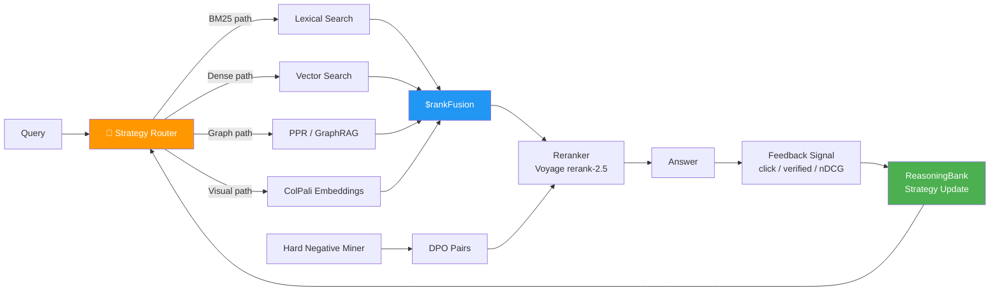

<div align="center">

# 🔍 Theme 3: Adaptive Retrieval

### RAG That Learns — Self-Improving Search Systems

[](ideas.md)
[](.)
[](.)

</div>

---

## What Makes This Theme Different

Standard RAG has one strategy: embed the query, find the nearest vectors, return results. This works until it doesn't — and it fails silently. A legal query that needs citation-graph reasoning gets the same treatment as a factual lookup. A chart in a scanned PDF returns nothing because there's no text to embed.

Adaptive Retrieval systems fix this by:

| Problem | Adaptive Solution |
|---------|------------------|
| Wrong retrieval strategy for query type | **Strategy router** — bandit or learned classifier picks between vector / BM25 / graph / visual |
| No feedback loop | **Reward signal** — analyst click, verified answer, or nDCG score updates strategy weights |
| Can't retrieve images or diagrams | **ColPali** — page-level VLM embeddings; no OCR needed |
| Single-hop only | **HippoRAG PPR** — multi-hop Personalized PageRank over a knowledge graph |
| Fails on reasoning-intensive queries | **BRIGHT-style decomposition** — rewrites the query before retrieval |

The result: a retrieval system that gets measurably better as users interact with it.

---

## Mental Model



---

## Anchor Papers

| Paper | Key Contribution | Use in Hackathon |
|-------|-----------------|-----------------|
| **ColPali** ([arXiv:2407.01449](https://arxiv.org/abs/2407.01449)) | VLM-based document retrieval with page-level embeddings; no OCR pipeline needed; handles charts, tables, figures | Index scanned PDFs, medical images, engineering schematics without any preprocessing |
| **Search-R1** ([arXiv:2503.09516](https://arxiv.org/abs/2503.09516)) | RL-trained retriever that learns *when* and *how* to search; reward = answer quality | Build the reward signal; let the strategy router improve from real usage |
| **GraphRAG** ([arXiv:2404.16130](https://arxiv.org/abs/2404.16130)) | Knowledge graph communities + LLM summarization; enables global reasoning across a corpus | Use for legal/regulatory/scientific corpora where relationships matter as much as text |
| **HippoRAG 2** ([arXiv:2502.14802](https://arxiv.org/abs/2502.14802)) | Hippocampus-inspired Personalized PageRank for multi-hop retrieval; associative memory | Use when queries require 2–4 hops across entities (gene → protein → pathway → disease) |
| **BRIGHT** ([arXiv:2407.12883](https://arxiv.org/abs/2407.12883)) | Reasoning-intensive retrieval benchmark; queries that require decomposition before search | Use as your eval harness; let Search-R1-style RL improve against BRIGHT-like queries |
| **Voyage AI rerank-2.5** (Aug 2025) | Instruction-following reranker; domain-specific instructions improve ranking dramatically | Use with custom instructions per corpus type (legal, medical, financial) |

---

## Common Building Blocks

### MongoDB Atlas Hybrid Search ($rankFusion)
```javascript
db.documents.aggregate([
  {
    $vectorSearch: {
      index: "vector_index",
      path: "embedding",
      queryVector: queryEmbedding,
      numCandidates: 100,
      limit: 20
    }
  },
  // Then $rankFusion blends with BM25 results
  {
    $rankFusion: {
      input: { pipelines: { vector: {}, text: {} } }
    }
  }
])
```

### Bandit Strategy Router
```python
from collections import defaultdict
import numpy as np

class BanditRouter:
    def __init__(self, strategies: list[str]):
        self.counts = defaultdict(int)
        self.rewards = defaultdict(float)
        self.strategies = strategies
    
    def choose(self, query_type: str) -> str:
        # UCB1 algorithm: explore vs. exploit
        total = sum(self.counts.values()) + 1
        scores = {
            s: (self.rewards[s] / max(self.counts[s], 1)) 
               + np.sqrt(2 * np.log(total) / max(self.counts[s], 1))
            for s in self.strategies
        }
        return max(scores, key=scores.get)
    
    def update(self, strategy: str, reward: float):
        self.counts[strategy] += 1
        self.rewards[strategy] += reward
        # Persist to MongoDB ReasoningBank
        db.strategy_rewards.insert_one({
            "strategy": strategy, "reward": reward,
            "query_type": query_type, "timestamp": datetime.now()
        })
```

### ColPali Page Indexing
```python
from colpali_engine.models import ColPali
import torch

model = ColPali.from_pretrained("vidore/colpali-v1.2")

def index_pdf_pages(pdf_path: str, doc_id: str):
    pages = convert_pdf_to_images(pdf_path)
    for i, page_img in enumerate(pages):
        embedding = model.encode_images([page_img])[0]
        db.page_embeddings.insert_one({
            "doc_id": doc_id, "page_num": i,
            "embedding": embedding.tolist(),
            "image_path": f"s3://.../{doc_id}/page_{i}.png"
        })
```

### Hard Negative Mining → DPO Pairs
```python
def mine_hard_negatives(query: str, retrieved: list, relevant_ids: set) -> list:
    """Mine near-miss results for DPO fine-tuning."""
    hard_negatives = [r for r in retrieved if r["_id"] not in relevant_ids]
    positives = [r for r in retrieved if r["_id"] in relevant_ids]
    
    dpo_pairs = [{"prompt": query, "chosen": pos, "rejected": neg}
                 for pos in positives for neg in hard_negatives[:3]]
    db.dpo_pairs.insert_many(dpo_pairs)
    return dpo_pairs
```

---

## Quick-Pick Guide

| Your Situation | Recommended Ideas |
|----------------|-------------------|
| Solo, 24h | #93 SoundFile · #98 SportsScout · #91 PulseTrend |
| Legal / compliance domain | #78 PrecedentBrain · #82 ComplianceCompass · #95 EvidenceTimeline |
| Healthcare research | #80 BiomedHive · #89 GenomeNav · #96 RadioAtlas |
| Finance / regulatory | #90 EdgarLinguist · #82 ComplianceCompass |
| Want maximum "wow" | Deep Dives: TruthWeight · Carbon Lie Detector · AdaptiveAtlas (#100) |
| Strong CV/multimodal skills | #79 ColPriorArt · #83 SatelliteMind · #88 ManuscriptVision |

---

## Index of All 23 Ideas

| # | Title | Domain | Difficulty | Key Innovation |
|---|-------|--------|-----------|----------------|
| 78 | PrecedentBrain | Legal | ⭐⭐⭐⭐ | Citation-graph authority weighting |
| 79 | ColPriorArt | IP / Legal | ⭐⭐⭐⭐ | Chemistry diagram + claim text fusion |
| 80 | BiomedHive | Drug Discovery | ⭐⭐⭐⭐ | HippoRAG PPR across 4 corpora |
| 81 | ThreatLens | Cybersecurity | ⭐⭐⭐⭐ | Bandit router on ATT&CK + IOC feeds |
| 82 | ComplianceCompass | Compliance | ⭐⭐⭐ | Jurisdiction-tagged index switching |
| 83 | SatelliteMind | Climate / Aerospace | ⭐⭐⭐⭐ | SAR + optical + text fusion |
| 84 | RepoSeer | Developer Tools | ⭐⭐⭐ | Call-graph hop retrieval |
| 85 | MachineMemoryFMEA | Manufacturing | ⭐⭐⭐⭐ | Time-series → document retrieval |
| 86 | MaterialsLens | Materials Science | ⭐⭐⭐⭐ | Bidirectional structure↔property |
| 87 | ClimateFusion | Climate | ⭐⭐⭐ | Uncertainty-aware multi-source fusion |
| 88 | ManuscriptVision | Cultural Heritage | ⭐⭐⭐ | Handwriting-adapted ColPali |
| 89 | GenomeNav | Healthcare Research | ⭐⭐⭐⭐ | Multi-DB ortholog PPR hops |
| 90 | EdgarLinguist | Finance | ⭐⭐⭐ | XBRL-aware multilingual retrieval |
| 91 | PulseTrend | Journalism | ⭐⭐⭐ | Sarcasm-tuned temporal decay |
| 92 | AsylumLens | Humanitarian | ⭐⭐⭐ | Low-resource language bridging |
| 93 | SoundFile | Creative Tools | ⭐⭐ | Multi-mode audio retrieval |
| 94 | CADLens | Manufacturing | ⭐⭐⭐⭐ | 3D geometric + semantic fusion |
| 95 | EvidenceTimeline | Legal / Journalism | ⭐⭐⭐⭐ | Video temporal localization |
| 96 | RadioAtlas | Healthcare Research | ⭐⭐⭐⭐ | DICOM + report + FHIR tri-modal |
| 97 | P&IDLens | Manufacturing | ⭐⭐⭐ | Symbol-graph-aware schematic search |
| 98 | SportsScout | Media | ⭐⭐ | Cross-league ReID retrieval |
| 99 | PhishLens | Cybersecurity | ⭐⭐⭐⭐ | Multi-modal threat intel fusion |
| 100 | AdaptiveAtlas | Open Source | ⭐⭐⭐⭐ | Self-benchmarking retrieval system |

---

## Navigation

| Previous | Home | Next |
|----------|------|------|
| [← Theme 2](../theme_2_multi_agent_collaboration/README.md) | [🏠 10_Hackathons](../README.md) | [All 23 Ideas →](ideas.md) |
